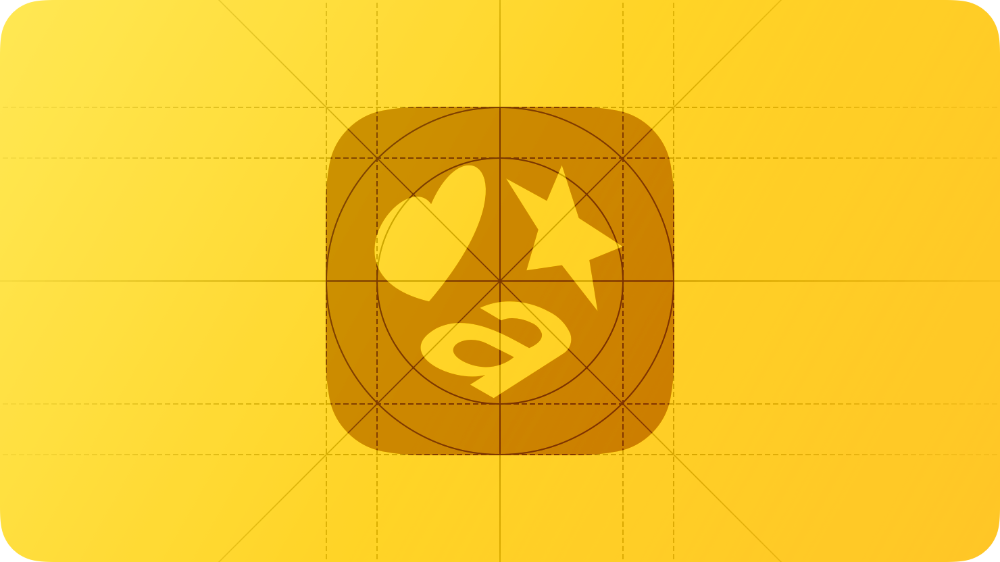
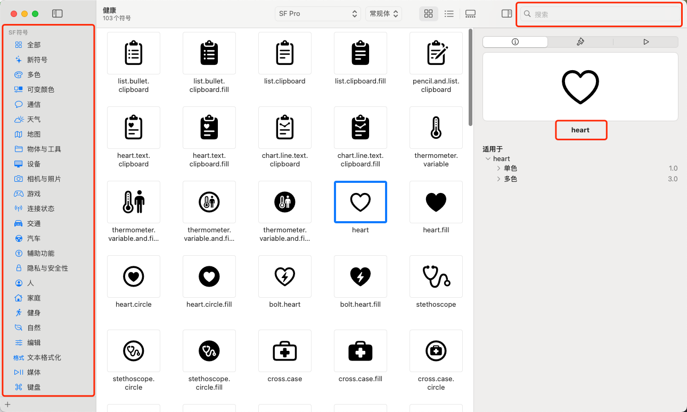

# SF Symbol

## SF Symbol 介绍



在 iOS、iPadOS 和 macOS 的界面设计中，图标不仅是装饰，更承载着信息传递和操作指引的核心作用。Apple 为开发者提供了 **SF Symbols** ——一套系统化、可缩放、可变色的矢量图标库，让设计与开发的界限更加模糊。

SF Symbols 的魅力在于它与系统字体 **San Francisco** 完美融合：图标大小、粗细、行高都能自动适配文本，无论是在按钮、列表，还是工具栏中，都能保持视觉一致性。更重要的是，它提供了丰富的语义化命名和多种样式（如填充、轮廓、圆角等），让开发者可以快速在代码中引用图标，而无需手动处理图片资源。

在这篇文章中，我们将带你深入了解 SF Symbols 的使用技巧、命名规则以及一些鲜为人知的小技巧，帮助你在 Swift 项目中快速搭建既美观又可维护的图标界面。无论你是 iOS 新手还是经验开发者，都能从中找到灵感与实用方法。

在阅读本篇文章之前，建议先花几分钟浏览以下资源，快速对 **SF Symbols** 有一个直观的了解，并下载 **SF Symbols App** 以便实践操作：

- [SF Symbols 介绍](https://developer.apple.com/cn/sf-symbols/)
- [SF 符号设计指南](https://developer.apple.com/cn/design/human-interface-guidelines/sf-symbols)

这样，你在后续的示例与技巧中会有更好的理解和操作体验。

<video src="../images/hero-sf-symbols-7.mp4"></video>


## SF Symbols App

在使用代码加载 SF Symbols 之前，建议先熟悉一下 **SF Symbols App**。这是 Apple 提供的一款官方工具，帮助我们快速浏览、搜索和筛选系统内置的符号。



SF Symbols 的命名通常由 **基础名词 + 修饰符** 组成：

- **基础名词**：表示符号本体，例如 `person`、`heart`、`star`。
- **修饰符**：用于表达形态或状态，例如：
  - **形态**：`fill`（填充）、`circle`（圆圈）、`square`（方形）、`badge`（徽章）
  - **状态**：`slash`（禁用）、`arrow`（方向）、`plus`（加号）、`minus`（减号）

这种组合方式非常规律，比如：

- `person.fill` → 实心人形
- `person.circle.fill` → 带圆圈并填充的人形
- `heart.slash.circle` → 圆圈包裹的“心形禁用”

因此，在使用 SF Symbols App 时，只要输入一个关键词（如 `heart`、`person`、`arrow`），通常就能快速找到目标图标及其所有变体。


当你在 **SF Symbols App** 中通过左侧浏览或右上角搜索找到心仪的符号后，有两种常见的使用方式：

1. **直接获取符号名称**
   - 在 App 右上角会显示该符号的系统名称，例如 `heart`。
   - 在代码中即可通过 `UIImage(systemName: "heart")` 来加载并使用。
2. **导出为 PNG 图片**
   - 如果你只需要一张静态图片（例如设计稿或非 iOS 项目使用），可以在菜单中选择导出 PNG。
   - 但在 iOS 开发中，更推荐直接使用系统名称加载，这样可以享受自动适配、动态调整大小和颜色等优势。


在大多数 **iOS 开发场景** 下，我们都会选择第一种方式 —— 使用符号名称加载图标。这样可以让符号和系统保持一致风格，也方便后续通过 `SymbolConfiguration` 调整大小、粗细和颜色。接下来，我们就通过代码来演示如何加载一个最常见的符号 —— **person**。


## SF Symbol 使用

SF Symbol的使用很简单，直接加载使用即可。

```
let image = UIImage(systemName: "wifi")
```

### SF Symbol 插入到文本中

SF Symbols 的设计理念之一，就是 **让图标能够像文字一样融入排版**。这与传统位图图标最大的区别在于：

- **字重一致**：符号有 `ultralight` 到 `black` 的多个字重，与系统字体的粗细完全对齐。
- **尺寸匹配**：符号大小会随文本 `pointSize` 自动缩放，不需要手动调整比例。
- **基线对齐**：符号的基线与文字一致，不会出现“漂浮”或“下沉”的现象。
- **行高协调**：符号的高度经过专门设计，能与段落或标题行高完美契合。

因此，当你把 SF Symbol 插入到文本中时，它并不是一张“插进来的图片”，而是像字母或标点一样，成为文本的自然组成部分。

这种特性让 SF Symbols 特别适合用于：

- 在文字描述中加入直观的符号（如“评分 ⭐ 4.5/5”）。
- 在按钮或菜单项中同时展示文字和图标。
- 在提示或警告文本中加入语义符号（如 `exclamationmark.triangle`）。

在 UIKit 中，你可以通过 `NSTextAttachment` 来将符号作为文字的一部分插入，例如：

```
let attachment = NSTextAttachment()
attachment.image = UIImage(systemName: "star.fill")

let attributedString = NSMutableAttributedString(string: "评分 ")
attributedString.append(NSAttributedString(attachment: attachment))
attributedString.append(NSAttributedString(string: " 1/5"))

let label = UILabel()
label.attributedText = attributedString
```


## SF Symbol  优势

相比手工插入 PNG 图标，SF Symbols 在文本排版中的优势在于：

- **动态适配**：自动跟随字体大小、粗细和辅助功能设置（如大号文字、粗体模式）。
- **无障碍支持**：符号自带语义信息，能够被 VoiceOver 正确识别和朗读。
- **一致的视觉风格**：符号与系统字体同源，避免了“图标和文字风格割裂”的问题。

这也是 Apple 强调 SF Symbols 的原因：图标不再是额外的装饰，而是 **文字系统的延伸**，在信息传递和无障碍体验上都更自然。
