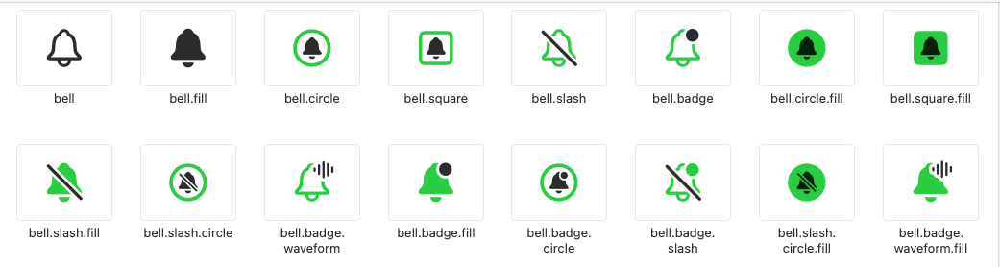

# SF Symbol Variants


从 **iOS 15** 开始，许多 SF Symbol 提供了 **变体（Variants）**，允许在同一个符号族里呈现不同风格或状态，例如 **填充、加斜线、带徽章、裁剪或方向变化**。

这些变体不仅仅是“换个样式”，而是 Apple 在设计体系中为不同语义和使用场景预设的视觉表达方式。



在 **UIKit** 中，变体通常通过 **符号名称后缀** 调用。例如：

```
let bell = UIImage(systemName: "bell")           // 普通铃铛
let bellFill = UIImage(systemName: "bell.fill") // 填充铃铛
let bellSlash = UIImage(systemName: "bell.slash") // 带斜线的铃铛
```

> ⚠️ 注意：并非每个符号都提供所有变体，具体可用性需要在 **SF Symbols App** 中确认。

### 1.  填充变体

`.fill` 后缀表示 **填充风格**，符号内部填充颜色，与轮廓风格形成对比。

```
UIImage(systemName: "star")       // 空心星星
UIImage(systemName: "star.fill")  // 填充星星
```

**设计思路**

- 填充风格通常用于 **强调或高亮状态**，例如收藏的“实心星标”、激活的按钮图标。
- 在同一符号族中，空心 → 默认/未选中，填充 → 选中/已启用，是一种视觉对比关系。


### 2. 形状变体

部分符号可以放入 **几何形状背景**，常用后缀包括 `.circle`、`.square` 等：

```
UIImage(systemName: "person.circle")      // 人物图标放在圆形背景
UIImage(systemName: "star.square")        // 星星图标放在正方形背景
UIImage(systemName: "heart.circle.fill")  // 圆形背景 + 填充心形
```

**设计思路**

- **圆形背景** 常用于头像、按钮或突出显示。

- **方形背景** 更适合列表图标、工具栏图标，保证方形对齐。

- 与 `.fill` 组合时，能形成更明显的状态区分。

  

### 3. 斜线变体

`slash` 后缀表示在符号上加一条 **斜线**，通常用于表达“禁用、关闭、无效”。

```
UIImage(systemName: "bell")          // 普通
UIImage(systemName: "bell.slash")    // 禁用
```

**设计思路**

- **Bell → Bell.slash** → 通知 / 静音
- **Eye → Eye.slash** → 显示 / 隐藏
- **Wifi → Wifi.slash** → 网络可用 / 网络不可用

可以理解为 **语义上的否定或反义状态**。


### 4. 裁剪变体

**`crop`** 表示“裁剪”，用于将符号主体限制在特定几何区域内。

```
UIImage(systemName: "person.crop.circle")        // 圆形裁剪的人物
UIImage(systemName: "person.crop.square")        // 方形裁剪的人物
UIImage(systemName: "person.crop.circle.fill")   // 圆形裁剪并填充
UIImage(systemName: "person.crop.circle.badge.plus") // 圆形裁剪 + 徽章
```

**设计思路**

- 常用于 **头像、缩略图** 等场景。
- 可以和 `.fill`、`.badge` 组合，形成复合语义。
- 裁剪只改变显示区域，不影响符号本身比例。


### 5. 徽章变体

**徽章（Badge）** 是附加在符号边角的小图标，表达状态或操作提示。
徽章 **不能单独使用**，必须附着在其他符号上。

#### 常见后缀

- `.badge.plus` → 添加
- `.badge.minus` → 删除 / 减少
- `.badge.checkmark` → 确认 / 完成
- `.badge.xmark` → 取消 / 错误
- `.badge.questionmark` → 疑问 / 帮助

```
UIImage(systemName: "person.badge.plus")    // 添加联系人
UIImage(systemName: "folder.badge.minus")   // 删除文件夹
```

#### 位置规律

- **矩形/长方形符号（如硬盘、文件夹）** → 徽章在 **左下角**。
- **圆形/对称符号（如人、眼睛）** → 徽章在 **右下角**。

#### trianglebadge

`trianglebadge` 是另一种徽章，语义上代表 **警告或异常**。

```
UIImage(systemName: "eye.trianglebadge.exclamationmark") // 视图警告提示
```

其特点为：

- 固定在 **右下角**
- 常用于“警告”或“提示”语境


### 6. 方向变体

许多符号支持方向变体，如箭头、手势或车辆方向。常用后缀：

- `.left`、`.right`、`.up`、`.down`
- `.forward`、`.backward`
- 组合方向：`.up.right`、`.down.left`

```
UIImage(systemName: "arrow.up")      // 向上箭头
UIImage(systemName: "arrow.up.right") // 向右上箭头
```

**设计思路**

- 箭头类符号 → 常用于导航、动作。
- 手势类符号 → 表示用户交互方向。
- 交通类符号（如车、飞机） → 表示移动方向。

### 7. 其他变体

除了以上规律性的变体，还有一些特殊的后缀，例如：

- `.dotted`（虚线）
- `.filled`（特殊填充效果）
- `.inverse`（反色效果）

这些符号通常出现在特定的设计上下文中，规律不明显。

> 💡 建议：遇到不确定的变体，可以直接在 **SF Symbols App** 中搜索关键字，查看所有相关组合。


