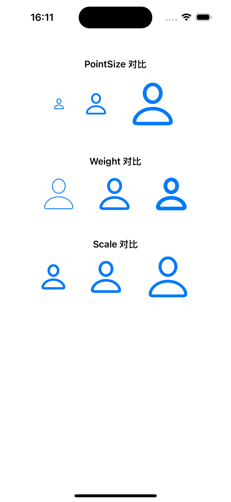

# SF Symbol Style


在 iOS 中，SF Symbols 不仅仅是“图标”，它们还是可配置的 **符号对象**，可以通过 `UIImage.SymbolConfiguration`灵活控制大小、粗细、缩放比例和颜色。

- **大小（pointSize）**：相当于字体字号，决定符号的基准尺寸。
- **粗细（weight）**：线条的粗细等级，对应系统字体粗细（ultraLight → black）。
- **缩放（scale）**：在同一字号下微调符号大小，常用于与文字对齐。
- **颜色（渲染模式）**：决定符号在界面中的视觉效果。

> 理解符号的渲染模式，有助于在不同背景、不同配色下保持符号清晰、易识别，同时营造层次感或强调效果。


### 1. 调整外观

在实际开发中，最常用的构造方法是：

```
public convenience init(pointSize: CGFloat, 
                        weight: UIImage.SymbolWeight, 
                        scale: UIImage.SymbolScale)
```

- **pointSize**：相当于字体字号，决定符号的基准大小。
- **weight**：线条粗细，对应系统字体的粗细等级（ultraLight → black）。
- **scale**：在指定字号下的相对缩放（small / medium / large），通常用来和文字搭配时微调符号大小。

> 同时系统也提供了其余多种初始化方法，让你可以有选择的配置大小、粗细和缩放比例。

<table>
<tr>
<td width="30%">
  
</td>
<td width="100%">
  <pre>
<strong>PointSize 对比</strong> 
let small = UIImage.SymbolConfiguration(pointSize: 20, weight: .regular, scale: .medium)
let medium = UIImage.SymbolConfiguration(pointSize: 40, weight: .regular, scale: .medium)
let large = UIImage.SymbolConfiguration(pointSize: 80, weight: .regular, scale: .medium)
<strong>Weight 对比</strong> 
let light = UIImage.SymbolConfiguration(pointSize: 60, weight: .ultraLight, scale: .medium)
let regular = UIImage.SymbolConfiguration(pointSize: 60, weight: .regular, scale: .medium)
let bold = UIImage.SymbolConfiguration(pointSize: 60, weight: .bold, scale: .medium)
<strong>Scale 对比（同字号下的微调）</strong> 
let scaleSmall = UIImage.SymbolConfiguration(pointSize: 60, weight: .regular, scale: .small)
let scaleMedium = UIImage.SymbolConfiguration(pointSize: 60, weight: .regular, scale: .medium)
let scaleLarge = UIImage.SymbolConfiguration(pointSize: 60, weight: .regular, scale: .large)
  </pre>
</td>
</tr>
</table>


### 2. 渲染模式

SF Symbols 提供四种渲染模式，每种模式背后都有设计理念，用来控制符号在界面中的颜色表现。理解渲染模式可以帮助你在不同背景、不同配色下保持符号的可读性和美观性。

#### 单色（Monochrome）

将一种颜色应用到符号中的所有层。符号中的路径以你指定的颜色渲染或者作为颜色填充路径中的透明形状。


直接加载出来的就是单色。

```
let image = UIImage(systemName: "externaldrive.badge.plus")
```

通过`tinkColor` 改变颜色

```
let image = UIImage(systemName: "person")?.withTintColor(.systemRed, renderingMode: .alwaysOriginal)
```

`withTintColor(_:renderingMode:)` 会受符号 **渲染模式（Rendering Mode）** 影响。

系统还提供了强制单色的渲染方式:

```
let monochrome = UIImage.SymbolConfiguration.preferringMonochrome()
let image = UIImage(systemName: "externaldrive.badge.plus", withConfiguration: monochrome)     
```

> preferringMonochrome 可能是为了后续新增的默认多色设计的，目前没看出来实现与不实现的区别。 

#### 分层（Hierarchical）

将一种颜色应用到符号中的所有层，通过给符号不同层级的路径应用 **不同不透明度**，形成层次感。


```
let hierarchical = UIImage.SymbolConfiguration(hierarchicalColor: .systemBlue)
let image = UIImage(systemName: "externaldrive.badge.plus", withConfiguration: hierarchical)
```


#### 多色（Multicolor）

为部分符号应用有内涵的颜色以增强含义。例如，`leaf` 符号使用绿色反映现实世界中树叶的外观，而 `trash.slash` 符号使用红色提示数据丢失。部分多色符号包括可接收其他颜色的层。

**注意**：仅对 **系统提供的多色符号** 有效，普通单色符号使用多色模式不会生效。


```
let multicolor = UIImage.SymbolConfiguration.preferringMulticolor()
// 会展示 leaf 默认的绿色
let image = UIImage(systemName: "leaf", withConfiguration: multicolor)
```


#### 调色盘（Palette）

自 iOS 15 起，许多 SF Symbol 将两种或更多种颜色应用到符号，每层使用一种颜色。你可以为每个片段单独指定颜色，从而实现更丰富的视觉效果。渲染规则如下：

- **符号只有 1 段**
  - 无论你提供多少颜色，符号只使用第一种颜色，其余颜色会被忽略。
- **符号有 2 段**
  - 如果只指定 1 种颜色 → 两段都使用同样颜色
  - 如果指定 2 种颜色 → 每段对应一种颜色
  - 如果指定 3 种颜色 → 第三种颜色会被忽略
- **符号有 3 段**
  - 如果只指定 1 种颜色 → 三段都使用同样颜色
  - 如果指定 2 种颜色 → 第一段使用第一种颜色，第二和第三段使用第二种颜色
  - 如果指定 3 种颜色 → 每段对应一种颜色


```
let config = UIImage.SymbolConfiguration(paletteColors: [.systemRed, .systemGreen, .systemBlue])
let image = UIImage(systemName: "person.3.sequence.fill", withConfiguration: config)
```


