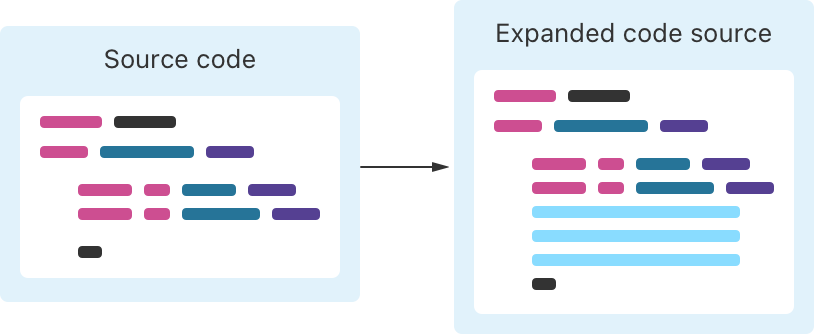
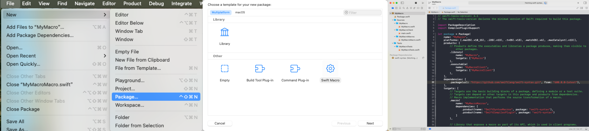
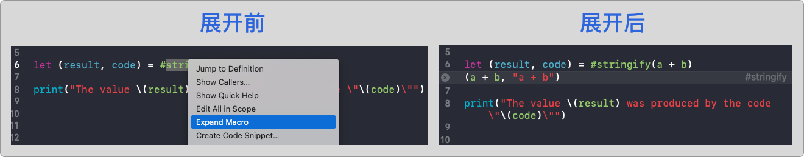

# Swift Macros - 宏之起点

Swift 宏（Macro）对许多开发者来说，是一种既熟悉又陌生的工具。在 Objective-C 时代，我们经常使用 `#define`、条件编译、日志封装，甚至自动插桩来提升开发效率。这些基于 C 的宏机制虽然灵活强大，却缺乏类型检查，容易引发错误，调试困难且可读性差。因此，Swift 在最初设计时，选择摒弃这种宏体系，专注于类型安全与语法清晰。

但这并不意味着 Swift 不需要“宏”能力。相反，随着语言的发展和应用场景的复杂化，开发者始终渴望一种**既安全又可控的自动代码生成机制**。正因如此，Swift 的全新宏系统应运而生。

自 Swift 5.9 起，Apple 正式引入了 **宏系统（Macros）**，它允许我们通过编译期的语法扩展（Macro Expansion）自动生成 Swift 代码，具备更强的表达力、更高的类型安全性，以及良好的 IDE 支持。相较于传统 C 宏，Swift 宏具备以下显著优势：

- 编译期类型检查，避免潜在错误
- 上下文感知，生成逻辑更加智能
- 保留原始源码的注释与格式，利于可读性与版本控制

宏会在编译阶段对源代码进行“展开”，自动生成结构化的 Swift 代码，帮助我们避免重复劳动。下图展示了宏展开的过程：



官方描述中提到，Swift 宏遵循“加法原则”：宏**只添加代码，不移除或篡改现有逻辑**，以确保代码结构和意图的清晰可控。这意味着，宏通常在现有代码基础上进行扩展，而不是完全替换原有的实现。

> 然而，实际上，Swift 宏的行为并非总是如此。特定类型的宏，如 **`BodyMacro`**，确实可以**完全替换现有代码**。因此，可以理解为在某些场景下，**完全替换代码是预期的行为**，而非违反“加法原则”的异常情况。
>
> 💡 个人认为：最初的 Swift 宏定义严格遵循“加法原则”，但随着 **`BodyMacro`** 类型的引入，这一原则在某些情况下被打破，以提供更高的灵活性和功能扩展。

更重要的是，Swift 会对宏的输入与输出进行语法与类型检查，确保生成的代码在语义上也是正确的。如果宏实现存在问题，或使用方式不符合规则，编译器会抛出错误，使得问题可以在编译期被及时发现。这种设计大幅提升了宏使用的可靠性与开发信心。

Swift 中的宏主要分为两类：

- **独立宏（Freestanding Macro）**：以表达式、语句或声明的形式出现在代码中，**不依附于任何已有声明**。
- **附加宏（Attached Macro）**：修饰某个已有的声明（如变量、函数、类型等），用于**为该声明自动生成附加代码**。

虽然这两类宏的使用方式略有不同，但它们共享统一的扩展机制，且都通过实现相应的协议来定义行为。接下来的章节将详细介绍这两种宏的使用场景、实现方式与典型示例。


## 认识宏

Swift 标准库中内置了一些我们耳熟能详的宏，例如 `#function`,  `#warning`：

```
func myFunction() {
    print("Currently running \(#function)")
    #warning("Something's wrong")
}
```

编译此代码时，Swift 会在编译阶段调用这些宏的实现。`#function` 会被替换为当前函数的名称，而 `#warning` 会生成编译器警告。

> **延伸阅读**：若你希望进一步了解内置宏的实现机制与定义，可参考以下资源：
>
> - [Apple 官方文档：使用宏](https://developer.apple.com/documentation/swift/externalmacro(module:type:))
> - [Swift 源码：标准宏定义（Macros.swift）](https://github.com/swiftlang/swift/blob/main/stdlib/public/core/Macros.swift)
> - [Swift 源码：内置宏实现示例](https://github.com/swiftlang/swift/blob/main/test/Macros/Inputs/syntax_macro_definitions.swift)


除了这些内置宏，Swift 还提供了**自定义宏**的能力。开发者可以通过实现自己的宏，在编译期生成结构化的 Swift 代码，从而减少样板逻辑，提高代码质量。


## 自定义宏

Swift 提供了自定义宏的能力，允许开发者通过 `externalMacro` 指定宏的实现位置，其语法如下：

```
@freestanding(expression)
macro externalMacro<T>(module: String, type: String) -> T
```

- `module` 表示宏实现所在的模块名称
- `type` 表示宏实现的类型名称（通常是一个 `Macro` 协议的实现类型）

需要注意的是，这个语法本身不会执行宏逻辑，而是用于**声明该宏应由哪个模块与类型来实现**。

> ⚠️ `externalMacro` 只能出现在宏定义的位置，不能在其他上下文中直接调用使用。


为了更好地理解和掌握 Swift 宏，我们将以官方提供的宏模板为起点，逐步拆解其结构、分类与实现方式，深入探索它如何帮助我们构建更简洁、更智能、更高效的 Swift 代码。


## 制作宏

### 1. 创建工程模板

Swift 宏的实现和使用分为多个阶段。以官方模板示例（ `#stringify`）为例，演示如何用 Xcode 创建一个可运行、可测试的宏工程。

> 要求：Xcode 15+，Swift 5.9+

通过 **File → New → Package** 创建一个新的 Swift 包，Xcode 会自动为你生成一个包含宏插件支持的标准结构。



**工程模版说明**

```
MyMacro/
├── Package.swift                 ← Swift 包描述文件 
├── Sources/
│   ├── MyMacro/                  ← 宏声明（对外暴露）
│   │   └── MyMacro.swift
│   └── MyMacroMacros/            ← 宏实现（逻辑 + 注册）
│       └── StringifyMacro.swift
├── Tests/
│   └── MyMacroTests/             ← 单元测试
│       └── MyMacroTests.swift
```

### 2. 定义宏的声明

```
@freestanding(expression)
public macro stringify<T>(_ value: T) -> (T, String) = #externalMacro(module: "MyMacroMacros", type: "StringifyMacro")
```


### 3. 实现宏的逻辑

```
import SwiftSyntax
import SwiftSyntaxBuilder
import SwiftCompilerPlugin
import SwiftSyntaxMacros

public struct StringifyMacro: ExpressionMacro {
    public static func expansion(
        of node: some FreestandingMacroExpansionSyntax,
        in context: some MacroExpansionContext
    ) -> ExprSyntax {
        guard let argument = node.arguments.first?.expression else {
            fatalError("compiler bug: the macro does not have any arguments")
        }

        return "(\(argument), \(literal: argument.description))"
    }
}
```

### 4. 注册宏的插件

```
@main
struct MyMacroPlugin: CompilerPlugin {
    let providingMacros: [Macro.Type] = [
        StringifyMacro.self,
    ]
}
```

> Swift 宏是编译期运行的，需要通过插件（Plugin）注册； `@main` 表示插件入口，编译器在构建时会执行这个插件进程。


## 使用宏

```
import MyMacro

let a = 17
let b = 25
let (result, code) = #stringify(a + b)

print("The value \(result) was produced by the code \"\(code)\"")
//打印结果：The value 42 was produced by the code "a + b"
```


如果其他开发者接手你的代码，可能会疑惑：这个 `#stringify` 究竟做了什么？Xcode 提供了查看宏展开结果的功能：

> **右键点击宏 → 选择「Expand Macro」**，即可看到宏生成的真实代码
>
> 


## 调试宏

在开发宏的过程中，调试是一件比较特殊的事。你可能会遇到这些问题：

- 设置了断点，但根本不会触发；
- 使用了 `print(...)`，却什么都没输出。

这并不是 Bug，而是 Swift 宏机制的特性。


宏是在一个 **独立的插件进程（Plugin Process）** 中执行的，这个进程由 Swift 编译器在构建期间调用。它与运行时环境无关，因此 **它的输出不会出现在运行控制台中**，**无法通过 LLDB 进行调试**。

官方推荐使用 **单元测试 + `assertMacroExpansion()`** 的方式进行宏调试。

```
assertMacroExpansion(originalSource: String, expandedSource: String, macros: [String : any Macro.Type])
```

这种方式能够：

- 显示宏调用的原始表达式；
- 展示宏展开后的完整源码；
- 自动校验是否与预期一致。

```
final class MyMacroTests: XCTestCase {
    func testMacro() throws {
        assertMacroExpansion(
            """
            #stringify(a + b)
            """,
            expandedSource: """
            (a + b, "a + b")
            """,
            macros: [ "stringify": StringifyMacro.self ]
        )
    }
}
```

上边的代码调用 `assertMacroExpansion` 方法传入的参数:

第一个参数是宏的调用方法 `#stringify(a + b)`，

第二个参数是展开预期结果 `(a + b, "a + b")`，

第三个参数是我们要测试的宏信息。


## 最后

在本篇中，我们了解了宏的起源、基本概念、使用方式与开发流程，也初步体验了 Swift 宏带来的便捷性。但这仅仅是一个开始。

你可能会思考一些问题：

- **一个完整的 Swift 宏是如何构成的？** 

  宏的内部到底是怎样工作的？它是如何在编译时自动生成代码的，甚至可以做到像手写代码一样的安全性和类型检查？

- **“独立宏”和“附加宏”到底有什么区别？** 

  它们分别适用于什么场景？在什么时候应该选择一个独立存在的宏，而在什么情况下又该使用一个附加到已有代码上的宏？

- **Swift 宏系统能怎么帮助我实现代码生成？** 

  如果我有很多重复的代码任务（比如编写 `Codable`、`Equatable`等），如何通过宏来减少重复工作，提升开发效率，而不需要每次手动编写一遍？

这些问题，都是理解 Swift 宏系统的关键。在你初次接触 Swift 宏时会感到迷茫，但正是这些思考，能够帮助你深入理解 Swift 宏系统的强大能力。

在下一篇《Swift Macros - 2. 宏之全貌》中，我们将从宏系统的设计理念出发，全面剖析 Swift 宏的结构组成与角色划分，建立起宏编程的认知地图。你将逐步掌握宏定义背后的底层原理，为真正驾驭 Swift 的编译期能力打下坚实基础。

