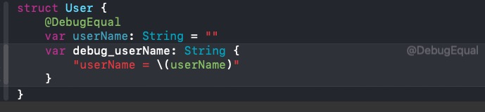

# Swift Macros - 宏角色与命名控制

在 Swift 宏系统中，**宏类型（Macro Kind）**、**宏角色（Macro Role）**与**命名说明符（Name Specifier）**共同决定了宏的使用范围和生成内容的可控性。

- **宏类型** 决定宏的附着方式；
- **宏角色** 决定宏可以干什么；
- **命名说明符** 决定宏生成的内容叫什么；

理解这三者，是编写稳定、可维护、具协作性的宏的前提。

## 1. 宏类型

表示宏的附着方式，它分为两类：

- **独立宏（Freestanding）**：使用 `@freestanding(...)` 标记，独立于任何已有声明，适合生成表达式或新的声明语句。
- **绑定宏（Attached）**：使用 `@attached(...)` 标记，附着在已有声明（如类型、函数、属性）上，用于扩展或修改它们的结构。

| 类型    | 展开位置                                 | 可生成内容                             | 示例用途             |
| ------- | ---------------------------------------- | -------------------------------------- | -------------------- |
| 独立宏  | 代码中的任意表达式或声明位置             | 表达式、声明语句（变量、类型、函数等） | 生成常量、表达式等   |
| 绑定宏` | 类型、函数、属性、扩展等的前后或内部位置 | 成员、访问器、扩展、函数体等           | 注入属性、协议实现等 |

> 📌 独立宏使用 `#宏名(...)` 语法，绑定宏使用 `@宏名` 修饰已有声明。

## 2. 宏角色：Swift 宏的职责划分与展开场景

Swift 宏不是一刀切的，它有明确的“职责划分”，这些职责被称为 **宏角色（Macro Role）**。每一个宏都必须声明其“角色”，告诉编译器它将在什么位置展开，以及要生成什么类型的语法结构。

宏角色可以分为以下几类：

| 宏角色                       | 宏描述             | 对应协议名             | 宏用途示例                         |
| ---------------------------- | ------------------ | ---------------------- | ---------------------------------- |
| `@freestanding(expression)`  | 表达式独立宏       | `ExpressionMacro`      | 替换表达式，生成新的表达式         |
| `@freestanding(declaration)` | 声明式独立宏       | `DeclarationMacro`     | 插入变量、函数、类型等声明         |
| `@attached(member)`          | 成员绑定宏         | `MemberMacro`          | 向类型内部插入成员（变量、函数等） |
| `@attached(peer)`            | 对等绑定宏         | `PeerMacro`            | 插入与目标声明并列的新声明         |
| `@attached(accessor)`        | 访问器绑定宏       | `AccessorMacro`        | 插入属性访问器（get、set等）       |
| `@attached(extension)`       | 扩展绑定宏         | `ExtensionMacro`       | 插入扩展声明（`extension`）        |
| `@attached(memberAttribute)` | 成员属性绑定宏     | `MemberAttributeMacro` | 修改成员属性上的注解或特性         |
| `@attached(body)`            | 替换声明体的绑定宏 | `BodyMacro`            | 替换函数、方法或计算属性的函数体   |

宏角色赋予了宏“编译期插件”的能力，开发者可以选择正确的角色，把宏的能力注入到特定结构，而不是无控制地生成代码。因此，宏角色也被称为 **“Swift 宏的功能标识”**。


### 如何选择正确的宏角色？

这取决于你想生成的内容：

| 想做的事情                       | 应使用的宏角色               |
| -------------------------------- | ---------------------------- |
| 生成一个表达式（如日志宏）       | `@freestanding(expression)`  |
| 在某个位置生成一个函数/类型等    | `@freestanding(declaration)` |
| 向已有类型添加属性、方法等成员   | `@attached(member)`          |
| 基于某声明并列插入“配套”声明     | `@attached(peer)`            |
| 给属性自动加上访问器（get/set）  | `@attached(accessor)`        |
| 给类型添加额外扩展（如协议实现） | `@attached(extension)`       |
| 修改已有成员的修饰符或属性注解   | `@attached(memberAttribute)` |
| 自动生成函数或计算属性的 `body`  | `@attached(body)`            |


## 3. 命名说明符：控制宏生成内容的命名方式

绑定宏生成代码时，常会生成**具名实体**：函数、变量、类型、扩展等。默认情况下，这些名称不明确，导致：

- 多宏协作时命名冲突；
- 工具链无法提供跳转、补全支持；
- 宏之间无法互相引用生成内容；
- 测试和验证困难。

因此 Swift 引入了 **命名说明符（name specifiers）**，允许在宏声明时指定生成内容的命名方式。


### 命名说明符的种类

| 名称方式            | 说明                               | 示例生成内容                |
| ------------------- | ---------------------------------- | --------------------------- |
| `named("xxx")`      | 直接指定名称                       | `func makePreview()`        |
| `prefixed("xxx_")`  | 给原始名称加前缀                   | `var debug_name: String`    |
| `suffixed("Async")` | 给原始名称加后缀                   | `func saveAsync()`          |
| `overloaded`        | 表示该成员为同名重载               | `func log(level:)`          |
| `arbitrary`         | 自定义命名，适用于工具生成辅助结构 | `_MetaHelper`，`__mapTable` |

**使用范围说明**

所有 `@attached(...)` 宏 和 `@freestanding(declaration)`。 `@freestanding(expression)` 不支持，因为它不生成命名实体。


### 使用时机与建议

**使用时机：**

- 生成对外可见代码（函数、属性）；
- 希望多宏协作，避免冲突；
- 需要支持代码跳转、补全、文档；
- 生成 DSL 或辅助结构。

**使用建议：**

- 统一前缀/后缀风格，方便识别；
- 用 `_` 或命名空间隐藏内部实现，避免命名污染；
- 通过具名成员留钩子供其他宏或模块访问；
- 谨慎使用 `arbitrary`，仅限工具生成结构；
- 表达式宏不需要命名说明符。

### 命名说明符的示例

#### 1. 给类型自动添加一个调试属性，属性名带前缀避免冲突

```
@attached(peer, names: arbitrary)
public macro DebugEqual() = #externalMacro(module: "McccMacros", type: "DebugEqualMacro")
```



## 4. 最后

Swift 宏并非简单模板，而是一套基于类型系统和结构规则的元编程能力。

- 宏类型告诉你“宏怎么附着”；
- 宏角色告诉你“宏能做什么”；
- 命名说明符告诉你“生成的内容叫什么”。

三者合力，使宏在复杂多模块环境中保持结构清晰、命名隔离与语义明确。

理解宏的职责控制与命名控制，是构建健壮、可维护宏功能的基石。

后续文章将详细拆解各宏角色的使用方式、限制与最佳实践，配合命名说明符示例，帮助你构建结构良好、可组合的宏能力体系。

> 📌 想打造真实可维护的宏框架？必须先理解角色，控制命名。
