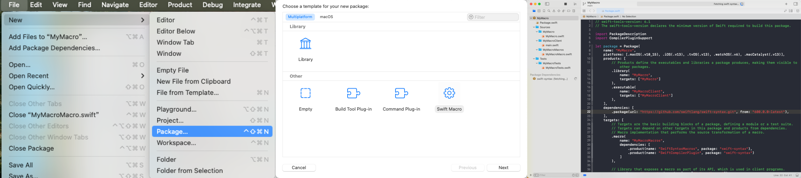
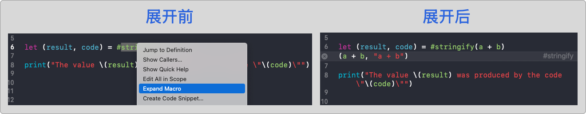

# Swift Macros - 宏之起点

Swift 宏（Macro）对于多数开发者来说，是一个熟悉又陌生的概念。我们在 Objective-C 时代早已习惯了使用宏：`#define`、条件编译、日志包装、甚至自动代码插桩。它们灵活强大，却也容易出错，调试困难，可读性差。因此，Swift 在设计初期选择了舍弃这种 C 风格宏，转而追求类型安全和语法清晰。

但这并不代表 Swift 不需要“宏”能力。相反，随着语言发展和应用复杂度提升，开发者一直在寻求一种**既安全又可控的方式来自动生成代码** —— 于是，Swift 宏系统应运而生。

Swift 5.9 起，Apple 正式引入了全新的 **宏系统（Macros）**，它允许我们通过编译时语法扩展（Macro Expansion）自动生成 Swift 代码，拥有更强的表达力、编译时安全性和 IDE 支持。相比于传统的 C 宏，Swift 宏具有类型检查、上下文感知、源码保持原样（保留注释/格式）等显著优势。

接下来我们就跟随 Swift 官方提供的宏模板，一步步探索这个全新的语言特性，理解它的结构、分类、实现方式，以及它如何帮助我们写出更简洁、更智能的 Swift 代码。


## 认识宏

Swift 标准库中也提供了不少宏，例如：`#function`, `#warning`。

```
func myFunction() {
    print("Currently running \(#function)")
    #warning("Something's wrong")
}
```

编译此代码时，Swift 会调用该宏的实现，并将其替换为当前函数的名称。同时Swift也提供了自定义宏能力的方法。


### 1. 创建工程模板

Swift 宏的实现和使用分为多个阶段。下面以官方模板示例（ `#stringify`）为例，演示如何用 Xcode 快速创建一个可运行、可测试的宏工程。

> 要求：Xcode 15+，Swift 5.9+

通过 **File → New → Package** 创建一个新的 Swift 包，Xcode 会自动为你生成一个包含宏插件支持的标准结构。



### 2. 工程模版说明

```
MyMacro/
├── Package.swift                 ← Swift 包描述文件 
├── Sources/
│   ├── MyMacro/                  ← 宏声明（对外暴露）
│   │   └── MyMacro.swift
│   └── MyMacroMacros/            ← 宏实现（逻辑 + 注册）
│       └── StringifyMacro.swift
├── Tests/
│   └── MyMacroTests/             ← 单元测试
│       └── MyMacroTests.swift
```

### 3. 定义宏的声明

```
@freestanding(expression)
public macro stringify<T>(_ value: T) -> (T, String) = #externalMacro(module: "MyMacroMacros", type: "StringifyMacro")
```

- `@freestanding(expression)`：声明这是一个表达式级别的宏；

- `#externalMacro(...)`：指定宏的实际实现位于 `MyMacroMacros` 模块中。

  

### 4. 实现宏的逻辑

```
import SwiftSyntax
import SwiftSyntaxBuilder
import SwiftCompilerPlugin
import SwiftSyntaxMacros

public struct StringifyMacro: ExpressionMacro {
    public static func expansion(
        of node: some FreestandingMacroExpansionSyntax,
        in context: some MacroExpansionContext
    ) -> ExprSyntax {
        guard let argument = node.arguments.first?.expression else {
            fatalError("compiler bug: the macro does not have any arguments")
        }

        return "(\(argument), \(literal: argument.description))"
    }
}
```

说明：

- `argument` 是传入宏的原始表达式；

- `argument.description` 获取表达式的源码字符串；

- `literal:` 将源码字符串转为 Swift 的字符串字面量。

  

### 5. 注册宏的插件

```
@main
struct MyMacroPlugin: CompilerPlugin {
    let providingMacros: [Macro.Type] = [
        StringifyMacro.self,
    ]
}
```

Swift 宏是编译期运行的，需要通过插件（Plugin）注册； `@main` 表示插件入口，编译器在构建时会执行这个插件进程。


## 使用宏

在工程的 `main.swift` 文件中

```
import MyMacro

let a = 17
let b = 25
let (result, code) = #stringify(a + b)

print("The value \(result) was produced by the code \"\(code)\"")
//打印结果：The value 42 was produced by the code "a + b"
```

宏 `#stringify(a + b)` 会在**编译期间**展开成 `(a + b, "a + b")`，返回表达式的值与其源码字符串。


如果其他开发者接手你的代码，可能会疑惑：这个 `#stringify` 究竟做了什么？Xcode 提供了查看宏展开结果的功能：

> **右键点击宏 → 选择「Expand Macro」**，即可看到宏生成的真实代码



宏会在编译时转换源代码，让开发者避免手动编写重复的代码。在编译过程中，Swift 会像往常一样先展开代码中的所有宏，然后再构建代码。 宏始终是一个加法操作：宏添加新代码，但永远不会删除或修改现有代码。


## 调试宏

在开发宏的过程中，调试是一件比较特殊的事。你可能会遇到这些问题：

- 设置了断点，但根本不会触发；
- 使用了 `print(...)`，却什么都没输出。

这并不是 Bug，而是 Swift 宏机制的特性。


### 为什么 `print` 不会输出？

**宏的执行发生在编译阶段**，而不是程序运行时，所以它的输出不会出现在运行控制台中。


### 为什么不能打断点？

宏是在一个 **独立的插件进程（Plugin Process）** 中执行的，这个进程由 Swift 编译器在构建期间调用。它与运行时环境无关，因此：

- **断点不会被触发**；
- **无法通过 LLDB 进行调试**；
- **所有调试行为都要在编译期完成**。


### 如何调试宏？

推荐使用 **单元测试 + `assertMacroExpansion()`** 的方式进行宏调试。

这种方式能够：

- 显示宏调用的原始表达式；
- 展示宏展开后的完整源码；
- 自动校验是否与预期一致。


## 测试宏

```
final class MyMacroTests: XCTestCase {
    func testMacro() throws {
        #if canImport(MyMacroMacros)
        assertMacroExpansion(
            """
            #stringify(a + b)
            """,
            expandedSource: """
            (a + b, "a + b")
            """,
            macros: testMacros
        )
        #else
        throw XCTSkip("macros are only supported when running tests for the host platform")
        #endif
    }
}

let testMacros: [String: Macro.Type] = [
    "stringify": StringifyMacro.self,
]
```

上边的代码调用 `assertMacroExpansion` 方法传入的参数:

第一个参数是宏的调用 `#stringify(a + b)`，

第二个参数是展开后的结果 `(a + b, "a + b")`，

第三个参数是我们要测试的宏。


# 最后

Swift 宏是 Swift 5.9 引入的一项极具扩展性的编译期特性。它让我们能够在编译期间“生成代码”，增强表达力并减少重复逻辑。

当然，如果你还在疑惑 Swift 宏到底能做什么，不要着急 — 这只是一个起点，接下来我们将深入探索更多类型的宏、实现方式、进阶技巧与应用场景。

