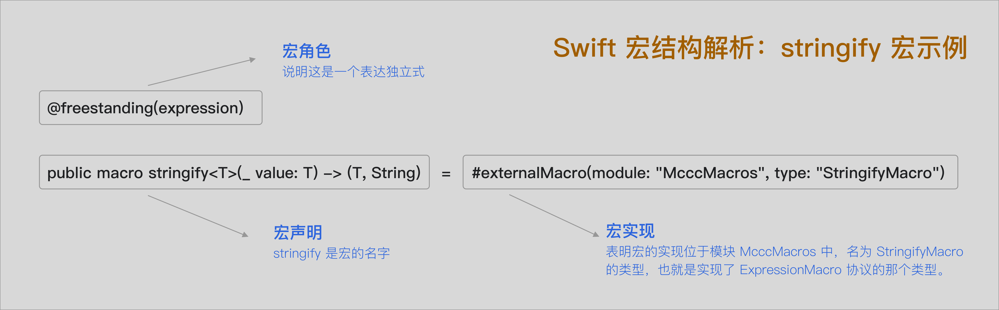
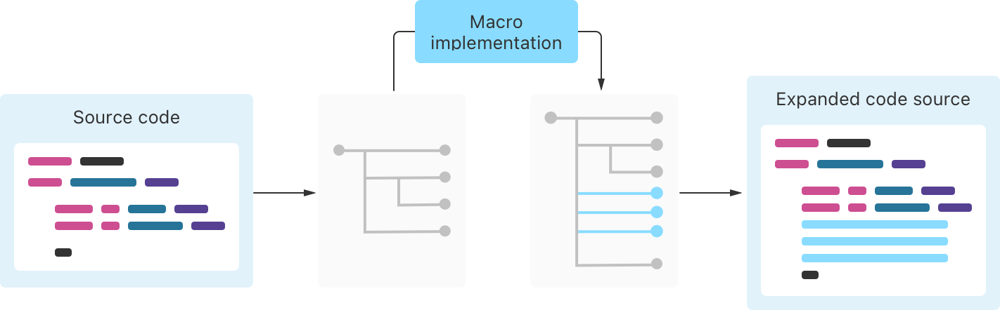

# Swift Macros - 宏之全貌

## 1. 宏的定义

**Swift 宏（Macros）** 是一种在编译期执行的代码生成机制，允许开发者通过简单的语法标记，在源代码中自动插入、修改或生成代码。它基于 Swift 的类型系统和语法分析能力，提供了 **类型安全** 和 **语义明确** 的元编程能力。



宏的优势主要体现在以下几个方面：

- **编译期执行，提升性能**
  宏在编译阶段展开，避免了运行时反射的性能开销，从而提高了程序的执行效率。
- **自动生成代码，减少样板重复**
  宏可以自动实现像 `Equatable`、`Codable`、属性监听等常见的重复性代码，极大提高开发效率。
- **类型安全，语法友好**
  宏生成的代码与手写代码一样，经过完整的类型检查和语法验证，确保代码的安全性与可靠性。


## 2. 宏的原则

在使用宏时，有几个重要的原则需要遵循：

* **明确的使用位置**

  宏的使用位置是显式的，代码中的宏调用一目了然，不会悄悄改变程序行为，读者可以清楚地看到哪里使用了宏。

* **完整的类型检查与验证**

  宏展开时会经过完整的类型系统检查，确保生成的代码类型正确。通过类型验证，避免出现类型错误。

* **可预测的插入方式**

  宏展开的代码会以可预测的方式插入原始源代码中，开发者可以明确预期其行为，避免出现无法理解或意外的结果。

* **宏不是魔法**

  宏的行为是明确的、可读的，并且不会绕过语言的规则或语义。你可以使用工具查看宏展开的代码，确保代码的透明性。


## 3. 宏的原理

Swift 宏的底层实现基于编译器插件（Compiler Plug-in），在 **编译期** 执行，并通过沙盒机制确保安全性和可预测性。

### 基本流程：宏的展开



1. **提取宏调用**
   Swift 编译器从源码中识别并提取出宏调用，转换为原始语法树（Raw Syntax Tree）。

2. **发送给插件**
   编译器将原始语法树发送给对应的 **宏插件**，该插件以 **独立进程** 的方式运行，并在严格的 **沙盒环境** 中执行。

3. **宏展开逻辑**
   宏插件根据定义的展开规则修改语法树，生成新的语法树。

4. **注入源码**
   编译器将新的语法树插入原始源码，生成最终的编译代码。

   

### 沙盒机制：安全性保证

由于宏插件运行在独立进程中，Swift 对它们的能力进行了强力限制。比如：

- **无法访问文件系统**（如通过 `FileManager` 读取文件）
- **不能发起网络请求**
- **无法执行任意系统调用**

尝试访问受限制的资源时会直接报错，如：`"The file “xxx” couldn’t be opened because you don’t have permission to view it."`

这种沙盒机制确保引入第三方宏插件时不会泄露敏感信息或执行恶意操作（例如沙盒中的挖矿行为）。


### 官方建议：宏的纯粹性

Swift 强烈建议将宏实现视为**纯函数**，遵循以下规则：

- 只依赖编译器传入的语法树信息
- 相同输入必须产生相同输出
- 避免使用外部上下文（如时间、随机数、文件系统等）

这样做的好处包括：

- 宏行为更可预测
- 编译器可以缓存宏结果，提升性能
- 避免不可调试的隐式副作用

不推荐的做法包括：

- 使用 `UUID()` 生成随机方法名 → 使得每次构建生成不同的代码
- 使用当前日期生成默认值 → 每天生成不同的值
- 在多个宏之间共享隐式上下文 → 隐藏行为，难以调试

**记住**：编写宏时，保持行为的可预测性和稳定性是非常重要的。


## 4. 宏角色：Swift 宏的功能标识

Swift 宏不是一刀切的，它有明确的“职责划分”，这些职责被称为 **宏角色（Macro Role）**。

Swift 使用 **独立宏（Freestanding）** 和 **绑定宏（Attached）** 来声明宏的角色。

* **独立宏**：使用`@freestanding(xxx)` 表示，可以单独存在，不依附任何已有代码。通常用于生成表达式或声明。

* **绑定宏**：使用 `@attached(XXX)` 表示，必须附着在已有代码元素上，例如类型、函数、属性等，用于扩展或修改已有结构。

不同的宏角色，需要实现不同的协议来完成展开逻辑，用来告诉编译器：“我这个宏能做什么”。因此： 宏角色也被称为 **“Swift 宏的功能标识”**。

| 宏角色                       | 宏描述             | 对应协议名             | 宏用途示例                         |
| ---------------------------- | ------------------ | ---------------------- | ---------------------------------- |
| `@freestanding(expression)`  | 表达式独立宏       | `ExpressionMacro`      | 替换表达式，生成新的表达式         |
| `@freestanding(declaration)` | 声明式独立宏       | `DeclarationMacro`     | 插入变量、函数、类型等声明         |
| `@attached(member)`          | 成员绑定宏         | `MemberMacro`          | 向类型内部插入成员（变量、函数等） |
| `@attached(peer)`            | 对等绑定宏         | `PeerMacro`            | 插入与目标声明并列的新声明         |
| `@attached(accessor)`        | 访问器绑定宏       | `AccessorMacro`        | 插入属性访问器（get、set等）       |
| `@attached(extension)`       | 扩展绑定宏         | `ExtensionMacro`       | 插入扩展声明（`extension`）        |
| `@attached(memberAttribute)` | 成员属性绑定宏     | `MemberAttributeMacro` | 修改成员属性上的注解或特性         |
| `@attached(body)`            | 替换声明体的绑定宏 | `BodyMacro`            | 替换函数、方法或计算属性的函数体   |

> 独立宏： 使用 `#`  调用。
>
> 绑定宏：使用 `@`  调用。

## 5. 宏协议：决定宏行为的功能接口

Swift 宏的能力建立在一套明确分层的协议体系上。这些协议定义了宏的**基本行为**、**适用场景**，以及**如何响应编译器的宏展开请求**。

### 宏的基础协议：`Macro`

这个协议是所有宏的根基，所有宏都遵循最顶层的协议 `Macro`，它定义了宏的基本能力和默认行为。

```
public protocol Macro {
  /// 控制宏展开后的代码是否格式化，默认为 `.auto`
  static var formatMode: FormatMode { get }
}
```

- `.auto`（默认）：使用格式化后的展开代码（推荐，一致性更好）
- `.disabled`：返回的语法结构会原样插入，不做额外格式处理（适合高度自定义输出）

### 宏的分类协议：`FreestandingMacro` 与 `AttachedMacro`

在 `Macro` 的基础上，Swift 将宏分为两大类：

*  `FreestandingMacro`：表示**独立使用的宏**，可以直接出现在表达式、语句、声明等位置，常用于**插入代码**或**生成值**。

```
public protocol FreestandingMacro: Macro {}
```

*  `AttachedMacro`：表示**附着在已有代码上的宏**，它必须绑定在类、结构体、属性、函数等已有声明上。

```
public protocol AttachedMacro: Macro {}
```

这两个协议本身没有任何扩展行为，它们是进一步细化为角色协议的“入口分类”。

> 💡 Swift 使用协议体系设计宏的目的是：
>
> - **分层清晰**：基础协议定义公共行为，高层协议划分使用场景，角色协议定义具体能力。
> - **编译器驱动**：根据宏的位置、角色，Swift 编译器会调用特定协议中的 `expansion(...)` 方法展开宏。
> - **类型安全**：协议方法都有强类型定义，展开时所处理的语法结构（Syntax）与上下文（Context）都有明确类型。

### 宏的角色协议

每个角色协议都需要实现静态方法 `expansion(of:in:)`，编译器在宏展开时会调用它，传入当前语法节点和上下文信息，返回的语法树会直接注入到用户代码中。

> 一个宏的实现本质上是遵循这些协议，并且可以同时实现多个协议，从而具备多重功能。
>
> ```
> public struct AutoCodableMacro: MemberMacro, AccessorMacro {
>     public static func expansion(...) -> [DeclSyntax] {
>         ......
>     }
> 
>     public static func expansion(...) -> [AccessorDeclSyntax] {
>         ......
>     }
> }
> ```
>
> 这正是 Swift 宏系统的强大之处：通过协议组合定义宏的 **多重角色**。


## 6. 宏角色协议详解

Swift 宏的强大能力来自其清晰的角色划分。每个宏在声明时都需明确其“扮演的角色”，即遵循的协议。这些协议决定了宏能操作的语法节点类型，以及允许插入哪些代码内容。Swift 提供了多个 `MacroRole` 协议，用以精细控制代码生成的时机与方式。

本节将逐一剖析各个角色协议的职责、调用时机、适用场景与使用技巧，为后续更高阶的设计（如命名冲突处理）奠定基础。

### 1. 表达式独立宏

```
public protocol ExpressionMacro: FreestandingMacro {
  static func expansion(
    of node: some FreestandingMacroExpansionSyntax,
    in context: some MacroExpansionContext
  ) throws -> ExprSyntax
}
```

**说明**：`ExpressionMacro`  继承于 `FreestandingMacro`， 它是独立宏的一种。它的宏角色为 `@freestanding(expression)`。

**作用**： 表达式宏可插入任意表达式，通常用于生成值、语句片段或调试信息。其执行结果会替换宏调用本身。

**用来**：动态计算值（如日志、追踪信息），对表达式进行包装、转换或格式化，生成常量或预定义表达式结构。


### 2. 声明式独立宏

```
public protocol DeclarationMacro: FreestandingMacro {
  static func expansion(
    of node: some FreestandingMacroExpansionSyntax,
    in context: some MacroExpansionContext
  ) throws -> [DeclSyntax]
}
```

**说明**：`DeclarationMacro` 继承于 `FreestandingMacro`，它是独立宏的一种。 它的宏角色为 `@freestanding(declaration)`。

**作用**： 插入新的声明（变量、函数、类型等）。


### 3. 对等绑定宏

**说明**：`PeerMacro` 继承于 `AttachedMacro`，它是绑定宏的一种。它的宏角色为 `@attached(peer)`。

**作用**： 在同一个作用域旁边生成平级结构。

```
public protocol PeerMacro: AttachedMacro {
  static func expansion(
    of node: AttributeSyntax,
    providingPeersOf declaration: some DeclSyntaxProtocol,
    in context: some MacroExpansionContext
  ) throws -> [DeclSyntax]
}
```


### 4. 访问器绑定宏

**说明**：`AccessorMacro` 集成于 `AttachedMacro`，它是绑定宏的一种。它的宏角色为 `@attached(accessor)`。

**作用**： 为属性添加访问器（get、set、didSet 等）。

```
public protocol AccessorMacro: AttachedMacro {
  static func expansion(
    of node: AttributeSyntax,
    providingAccessorsOf declaration: some DeclSyntaxProtocol,
    in context: some MacroExpansionContext
  ) throws -> [AccessorDeclSyntax]
}
```


### 5. 成员属性修饰宏

**说明**：`MemberAttributeMacro` 集成于 `AttachedMacro`，它是绑定宏的一种。它的宏角色为 `@attached(memberAttribute)`。

**作用**：为成员添加统一修饰符或属性标签。

```
public protocol MemberAttributeMacro: AttachedMacro {
  static func expansion(
    of node: AttributeSyntax,
    attachedTo declaration: some DeclGroupSyntax,
    providingAttributesFor member: some DeclSyntaxProtocol,
    in context: some MacroExpansionContext
  ) throws -> [AttributeSyntax]
}

```


### 6. 成员绑定宏

**说明**：`MemberMacro` 集成于 `AttachedMacro`，它是绑定宏的一种。它的宏角色为 `@attached(member)`。

**作用**： 为类型添加成员（属性、方法、构造器等）。

```
public protocol MemberMacro: AttachedMacro {
  static func expansion(
    of node: AttributeSyntax,
    providingMembersOf declaration: some DeclGroupSyntax,
    in context: some MacroExpansionContext
  ) throws -> [DeclSyntax]

  static func expansion(
    of node: AttributeSyntax,
    providingMembersOf declaration: some DeclGroupSyntax,
    conformingTo protocols: [TypeSyntax],
    in context: some MacroExpansionContext
  ) throws -> [DeclSyntax]
}
```


### 7. 替换声明体绑定宏

**说明**：`BodyMacro` 集成于 `AttachedMacro`，它是绑定宏的一种。它的宏角色为 `@attached(body)`。

**作用**：它 **补充现有成员的代码体**，比如生成计算属性的实现，或者为已有的方法添加函数体。它并不会添加新的变量、方法或属性。它的作用是给现有的成员提供具体的实现或行为。

```
public protocol BodyMacro: AttachedMacro {
  static func expansion(
    of node: AttributeSyntax,
    providingBodyFor declaration: some DeclSyntaxProtocol & WithOptionalCodeBlockSyntax,
    in context: some MacroExpansionContext
  ) throws -> [CodeBlockItemSyntax]
}
```


### 8. 扩展绑定宏

**说明**：`ExtensionMacro` 集成于 `AttachedMacro`，它是绑定宏的一种。它的宏角色为 `@attached(extension)`。

**作用**：为类型生成扩展结构，常用于协议一致性等。

```
public protocol ExtensionMacro: AttachedMacro {
  static func expansion(
    of node: AttributeSyntax,
    attachedTo declaration: some DeclGroupSyntax,
    providingExtensionsOf type: some TypeSyntaxProtocol,
    conformingTo protocols: [TypeSyntax],
    in context: some MacroExpansionContext
  ) throws -> [ExtensionDeclSyntax]
}
```


> #### 未公开使用的试验宏
>
> **CodeItemMacro**：插入更宽泛的代码片段（如 `#warning`, `#if` 结构）
>
> **PreambleMacro**：  为当前文件自动注入文件级别代码（如日志、标识信息）


宏角色协议为我们提供了结构清晰的扩展机制，但当多个宏协作时，或同一宏生成多个成员时，我们会面临另一个问题 ：命名。生成成员如果不能具名，就可能导致命名冲突、可读性下降甚至工具链识别失败。
在下一节中，我们将介绍 Swift 宏中一个精巧但强大的机制：「命名说明符（Name Specifier）」，它是解决这些问题的关键。


## 7. 命名说明符: 绑定宏中的命名控制器

在使用绑定宏（如 `MemberMacro`、`AccessorMacro` 等）时，我们往往需要为生成的成员命名。然而，直接在 `expanded` 中返回声明字符串虽然简单，但存在一定的局限性：Swift 会将你生成的成员视为“无名成员”，这意味着：

- 编译器无法在符号层级识别这些生成内容的具体名称；
- 宏的生成行为缺乏可控性，尤其在多个宏同时生成代码时，可能出现符号名冲突的问题；
- 生成内容对其他宏或工具（如代码补全、文档工具等）不可见或不稳定。

为了解决这些问题，Swift 宏系统引入了“命名说明符”（Name Specifier）的机制，它可以显式指定宏所生成声明的名称。这不仅增强了宏生成行为的可控性，也为宏之间的协作提供了可能。

```
@attached(extension, names: named(==))
```


### 命名说明符的种类

| 命名说明符             | 作用场景                   | 原始声明           | 宏生成结果                           |
| ---------------------- | -------------------------- | ------------------ | ------------------------------------ |
| `overloaded`           | 创建重载版本               | `func log()`       | `func log(level: LogLevel)`          |
| `prefixed("debug_")`   | 添加前缀区分功能           | `var count: Int`   | `var debug_count: Int`               |
| `suffixed("Async")`    | 创建变体版本（如异步方法） | `func load()`      | `func loadAsync()`                   |
| `named("makePreview")` | 生成固定名称的成员         | `struct MyView {}` | `static func makePreview()`          |
| `arbitrary`            | 完全自定义命名（复杂场景） | `struct User {}`   | `_UserFlagsHelper`, `internalMap` 等 |

> √  命名说明符适用于所有 **绑定宏(@attached)** 和 **声明独立宏(@freestanding(declaration)**，因为这些宏会生成具名实体（如属性、函数、类型等）。

> ×  **`@freestanding(expression)` 宏不支持命名说明符**，因为它仅生成表达式语法，不引入命名实体，无法参与命名策略。


### 命名说明符的优势

- **避免命名冲突**：多个宏在一个作用域下生成代码时，可以通过设定名称避免彼此覆盖；
- **控制名称风格**：可以根据源属性名生成衍生名，如 `_propertyNameLogger`；
- **提升工具支持能力**：具名的符号可以被 IDE 理解、被语法高亮、被文档工具索引；
- **支持后续访问**：如果其他宏需要引用该生成成员，具名成员更容易定位和访问。


### 为什么这很重要？🤔 

命名说明符的价值不仅在于解决冲突，更重要的是：

- 使自动生成的代码看起来像手写代码一样自然
- 建立可维护的代码生成规范
- 提升团队协作效率
- 为未来的代码演进预留空间

命名说明符是 Swift 宏系统中的一个关键设计，旨在平衡代码生成的便利性与命名的精确性。通过合理运用这些策略，开发者可以构建出既强大又易于维护的代码库。


## 8. 宏的结构设计

在 Swift 宏的设计中，宏的行为由宏协议（Macro Protocol）定义。每种宏都有一个特定的“角色”，并且这个角色决定了它必须实现的协议。理解这些角色和协议之间的关系，是实现高效宏设计的关键。本节我们揭开宏的结构设计：

- 宏角色是什么
- 每种宏角色应该实现什么协议
- 协议的 `expansion` 方法如何工作
- 各类宏协议与角色的对应关系

你将建立起这样的思维模型： **每一种宏的“角色” → 需要实现的“协议” → 要完成的“行为”**。


接下来我们将正式进入宏的设计与实现部分， 整个思考的过程也遵循：

| 思考过程                        | 详细解读                                                     |
| ------------------------------- | ------------------------------------------------------------ |
| 1. **你想扩展什么？**           | 首先思考你希望宏扩展的内容是什么。它是一个表达式、类型、属性，还是声明？ |
| 2. **这属于哪种角色？**         | Swift 宏有不同的角色，每种角色都扮演着不同的功能。理解每个宏的角色，是决定它应该遵循哪些协议的基础。 |
| 3. **这个角色要实现哪个协议？** | 不同的宏角色必须实现不同的协议，这些协议定义了宏在执行过程中需要完成的行为。 |

掌握这个结构后，你就可以自由实现任何类型的宏了。接下来我们就开始实现它吧！


