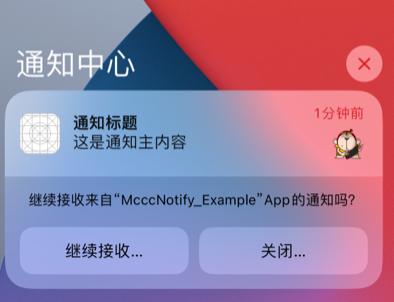

# 通知策略三部曲（上）— 权限获取的第一公里的信任

**当精心设计的推送系统遇上人性的防御机制**

就像一位博物馆讲解员，还没等游客走进展厅，就拦在门口问："要付费购买语音导览吗？"——大多数人的反应必然是摇头。这不是游客不愿了解展品，而是时机错得离谱。

在iOS生态中，通知权限的获取面临同样的困境，这迫使我们必须重新思考：不是"如何索取权限"，而是"如何让用户主动想要开启通知"。


## 一、当通知权限成为稀缺资源

> **"在iOS上，通知权限比黄金还珍贵。"** — 一位资深产品经理的感叹

iOS系统的通知权限机制设计极具挑战性：

- **一次机会**：系统权限弹窗仅能触发一次
- **无法定制**：开发者不能修改弹窗样式和文案
- **瞬时决策**：用户平均仅用2秒决定（Stanford数据）
- **挽回困难**：首次拒绝后，二次授权成功率<15%

换句话说：**你只有一次机会让用户说“好”**。

```
// 这行代码的价值可能决定整个推送系统的成败
UNUserNotificationCenter.current().requestAuthorization(options: [.alert, .sound]) { granted, _ in
    print("通知权限状态：\(granted ? "已获取" : "已失去")")
}
```

这就要求我们**不再问“怎么拿到权限”**，而是反过来思考：

> **如何让用户主动“想要”打开通知权限？**


## 二、如何合理地获得通知授权

在推送系统中，**获取权限的方式往往比获取权限本身更重要**。强行弹窗请求，哪怕技术上正确，也可能导致产品体验和转化的双重失败。

以下是三条经过实践验证的“黄金法则”，帮助你更合理、自然地引导用户授权通知。


### 1. 先约会，再求婚

最忌讳的是在用户打开 App 的第一秒就弹出系统弹窗：

> **“我还不知道你是谁，你就要我信任你？”**

更合理的做法，是在用户完成一个有意义的操作之后，再顺势提出请求。

这时用户已感受到产品价值，对 App 有了初步信任，接受度会明显提升。

#### 案例：某健身 App 的策略

1. 用户完成首次训练任务
2. 弹窗提示：“想记录你的每日进步吗？”
3. 选项：“稍后再说” / “接收进度提醒”
4. 点击后，才触发系统通知权限弹窗

```
func showPermissionAfterWorkout() {
    let customAlert = CustomAlertView(
        title: "每日进步提醒",
        desc: "开启通知，接收训练记录和定制计划",
        confirmAction: { requestSystemPermission() }
    )
}
```


### 2. 把握黄金触发时机

场景选择对授权率有显著影响：

| 触发场景           | 平均授权率 | 适用产品类型             |
| ------------------ | ---------- | ------------------------ |
| 用户完成核心功能后 | 62%        | 工具类（如健身记录）     |
| 首次获得社交互动时 | 71%        | 社区类（如点赞/评论）    |
| 触发高价值事件前   | 58%        | 电商类（如商品降价提醒） |

把权限请求嵌入在**用户感知价值的高光时刻**，让“授权”成为用户主动维护体验的一部分，而非被动接受的要求。

#### 案例：系统检测到风险动态

- 例如：该企业刚刚新增一条法律诉讼
- 弹窗提示：“刚刚有新变更！开启通知不错过企业最新风险信息。”

此类“即将错过重要信息”的时刻，用户感知强烈，转化率显著提升。


### 3. 渐进式信任

iOS 12 引入的 `.provisional` 权限为我们提供了一个优雅的方案：**不打扰用户，不请求弹窗，悄悄开始通知体验**。



系统**不会弹出授权框**，通知**直接出现在通知中心**，但**不会弹窗、震动或响铃**，用户可以在通知中心选择“继续接收”或“关闭通知”。

点击“继续接收”后，权限立即升级为正式授权，无需再触发弹窗。

```
let options: UNAuthorizationOptions = [.alert, .sound, .provisional]
UNUserNotificationCenter.current().requestAuthorization(options: options) { granted, _ in
    print("静默通知状态：\(granted)")
}
```

这是一种**“先让你用用看”**的设计思路，降低用户决策成本，提高转化率。


需要注意的是：即使包含了 `.alert`、`.sound` 和 `.badge`，**初始时和同意授权后也不会真正生效**，因为：

> ✅ 用户同意后获得的是临时权限，但不会弹横幅、不会发声音、也不会更新角标，只有**通知中心展示**。

需要引导用户去设置里面开启。


### 4. 给拒绝留条后路

用户拒绝了，不代表永远不需要通知。正确的策略：在合适的时机，用场景化的方式再次引导。

#### 案例：某银行 App 的做法

- 在转账成功页面底部放置提示按钮：“开启到账提醒 →”
- 点击后跳转到一个设计精美的引导页：
  - 展示通知样式预览图
  - 通过时间轴说明通知触发时机
  - 提供“去设置开启通知”按钮（跳转至系统设置）

> 📊 实测表明，这类设计让二次开启率 **提升了 3 倍**。


### 5. 主动尊重用户：提供“退出通道”

许多 App 在用户拒绝或关闭通知时选择沉默，实际上这是错失了挽留用户的关键机会。聪明的做法是**主动赋权用户管理通知偏好**，而非让他们被动接受或直接关闭。

具体做法包括：

- 在部分关键通知中，附加跳转到通知设置页的入口。

- 例如在通知的 `userInfo` 字段中放入设置链接：

  ```
  content.userInfo = ["settings_url": "app://notification_prefs"]
  ```

- 鼓励用户根据喜好调整推送频率和内容，而非默认关闭。

这种设计传递出三重积极信号：

1. **尊重用户选择权**，减少抵触感
2. **延缓关闭通知的决策**，降低“一键关闭”的概率
3. **强化信任机制**，让用户知道自己掌控推送节奏

这不是技术层面的小技巧，而是一种产品哲学：**在通知设计中体现“用户自主”的力量**。


## 三、通知权限的配置选项

在我们深入设计推送策略之前，还有一个关键问题常常被忽略：

> “**我们到底向用户请求了什么样的通知权限？**”

`UNAuthorizationOptions` 提供了一系列配置选项，每一项都决定了用户将看到什么样的通知内容，也决定了能否实现特定场景下的推送逻辑。

| 权限选项                           | 引入版本  | 是否常用 | 场景建议                                                     |
| ---------------------------------- | --------- | -------- | ------------------------------------------------------------ |
| `.alert`                           | iOS 10.0+ | ✅ 常用   | 展示横幅、锁屏提醒等“视觉内容”。适合所有需要用户注意的推送。 |
| `.badge`                           | iOS 10.0+ | ✅ 常用   | 更新 App 图标角标（如“3 条新风险”），适合未读提醒类。        |
| `.sound`                           | iOS 10.0+ | ✅ 常用   | 播放提示音，建议用于需要即时注意的紧急推送。                 |
| `.carPlay`                         | iOS 10.0+ | 少见     | 在车载系统中展示通知，适合与行车相关的服务类 App。           |
| `.criticalAlert`                   | iOS 12.0+ | 特殊权限 | 用于**绕过静音与勿扰**的极端重要通知，需 Apple 审核。        |
| `.providesAppNotificationSettings` | iOS 12.0+ | 说明性   | 在系统通知详情页展示“通知设置”按钮，增强设置透明度。         |
| `.provisional`                     | iOS 12.0+ | 建议尝试 | “静默通知”选项，**无需弹窗**，适合新用户阶段试探性推送。     |
| `.announcement`                    | iOS 13.0+ | ❌ 弃用   | 原用于 VoiceOver 自动读出内容，现已合并进基础权限中。        |
| `.timeSensitive`                   | iOS 15.0+ | ❌ 弃用   | 原为“时间敏感通知”授权，现在转由 Entitlements 控制。         |

用户点击“允许通知”时，他们并不知道你具体会做什么。而开发者配置的这些选项，决定了用户接收到什么、怎么接收、接收多少 ——
 而这些，将直接影响到用户对 App 通知体验的“第一感知”。


## 四、权限不是终点，而是起点

用户点击“允许通知”不是结束，而是关键的「**信任窗口**」的开始。

此时，你需要立刻完成一件件事：**即时反馈**，发送一条欢迎通知（带有个性化内容）

此时用户处于**承诺一致性**的心理状态，他们刚刚做了一个决定，会下意识寻找支持这个决定的证据。我们要做的，就是立即提供这种证据。在用户授权通知权限后立即发送一条**个性化欢迎通知**，这看似是个小细节，实则是精心设计的「心理锚点」。背后的产品逻辑和用户心理机制值得深入剖析。

#### 为什么**第一条通知**如此重要？

| 作用         | 解读                                                         |
| ------------ | ------------------------------------------------------------ |
| 消除用户疑虑 | 用户刚同意权限，如果不立刻展示结果，容易后悔。就像一颗"定心丸"："看，这就是您同意的通知，它很有用"。 |
| 建立质量标杆 | 建立质量预期。是有价值的个性化内容，用户会默认后续通知都如此优质；是广告，用户会直接关闭权限。 |
| 激活使用场景 | 通过具体示例展示通知将如何服务用户，比如："当您关注的商品降价时，我们会这样提醒您"。 |

**完美首条通知的三要素**

1. **个性称呼**：让通知不那么“像广告”
2. **明确价值**：告诉用户你为什么通知他
3. **5 秒延迟**：避免与 UI 操作冲突，确保体验流畅

```
func sendWelcomeNotification() {
    let content = UNMutableNotificationContent()
    content.title = "\(用户名)，欢迎使用智能提醒"         // 个性称呼
    content.body = "当您收藏的商品降价时，我们会立即通知您" // 明确价值
    content.sound = .default

    let trigger = UNTimeIntervalNotificationTrigger(timeInterval: 5, repeats: false)
    let request = UNNotificationRequest(identifier: "welcome_msg", content: content, trigger: trigger)
    UNUserNotificationCenter.current().add(request)
}
```

