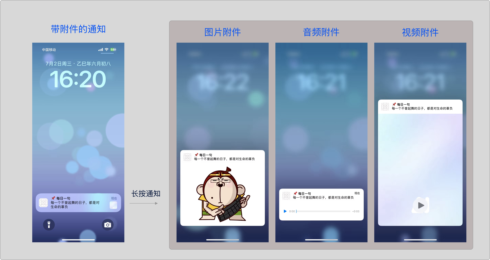
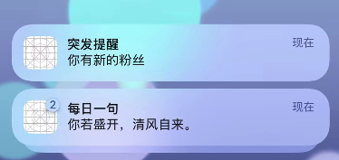

#  本地通知内容深度解析 — 打造丰富的通知体验

很多开发者在使用 `UNMutableNotificationContent` 时，往往只关注标题和正文，忽略了 Apple 提供的一系列定制化能力。本章将带你系统掌握这些能力，为你的通知赋予更多表现力和个性化。

本章将围绕 `UNMutableNotificationContent` 展开，详解它的各项配置能力，帮助你打造出兼具信息性与吸引力的通知内容。

## 1. 是什么？

`UNMutableNotificationContent` 是 iOS 中配置本地通知内容的主要类，继承自 `UNNotificationContent`，用于设置标题、正文、声音、附件等视觉与听觉信息。示例：

```
let content = UNMutableNotificationContent()
content.title = "🔔 提醒"
content.body = "你还有一项待完成的任务"
content.sound = .default
```

## 2. 常用属性

| 属性                      | 类型                              | 用途                                                         |
| ------------------------- | --------------------------------- | ------------------------------------------------------------ |
| `title`                   | `String`                          | 通知标题                                                     |
| `subtitle`                | `String`                          | 子标题（在 `title` 下方展示）                                |
| `body`                    | `String`                          | 主内容，支持多行显示                                         |
| `badge`                   | `NSNumber?`                       | 设置 App 图标的角标数字                                      |
| `sound`                   | `UNNotificationSound?`            | 通知音效                                                     |
| `attachments`             | `[UNNotificationAttachment]`      | 图像、音频或视频附件                                         |
| `categoryIdentifier`      | `String`                          | 配合交互动作使用                                             |
| `userInfo`                | `[AnyHashable: Any]`              | 自定义字段，可用于跳转逻辑                                   |
| `threadIdentifier`        | `String`                          | 线程 ID，用于合并通知显示                                    |
| `interruptionLevel`       | `UNNotificationInterruptionLevel` | 设置通知优先级，影响通知的打断行为（如静默、时间敏感等）（iOS 15+） |
| `relevanceScore`          | `Double`                          | 通知的相关性评分，系统用来决定通知的排序和优先级（iOS 15+）  |
| `filterCriteria`          | `String?`                         | 用于智能筛选通知，提高用户体验（iOS 16+）                    |
| `targetContentIdentifier` | ` String?`                        | 帮助系统区分通知内容，实现更智能的展示和归类                 |

## 3. 通知声音：吸引注意

通知支持使用系统默认音效，或自定义音频文件：

```
content.sound = .default  // 系统默认音效
content.sound = UNNotificationSound(named: UNNotificationSoundName("earlyRiser.m4a"))
```

### 使用注意

- 音频需小于 30 秒，格式推荐 `.caf`, `.m4a`, `.aiff`
- 路径需为 `main bundle`，不可来自附件或 URL
- 若无法播放，建议检查：
  - 是否静音模式
  - 是否开启通知声音权限
  - 文件是否损坏或格式不兼容


## 4. 通知附件：让通知更具吸引力



`attachments` 是一个 `[UNNotificationAttachment]` 数组，支持加载本地的图片、音频、视频等文件作为通知的多媒体附件。

- 这些资源必须先存储在设备本地的文件系统中，比如 app 的沙盒目录（`Documents`、`tmp` 等）。

- 不能直接传入 UIImage 或网络 URL，需要先把资源下载或复制到本地文件路径，然后用本地文件 URL 创建 `UNNotificationAttachment`。

  ```
  func downloadAndAttachImage(from url: URL, completion: @escaping (UNNotificationAttachment?) -> Void) {
      URLSession.shared.downloadTask(with: url) { localURL, response, error in
          guard let localURL = localURL else {
              completion(nil)
              return
          }
          do {
              let attachment = try UNNotificationAttachment(identifier: "remoteImage", url: localURL, options: nil)
              completion(attachment)
          } catch {
              print("创建附件失败：\(error)")
              completion(nil)
          }
      }.resume()
  }
  ```

* 虽然`attachments` 是一个数组，**但系统在实际展示通知时通常只显示其中的一个附件**（通常是第一个）。

  苹果将其设计为数组，**是出于扩展性和灵活性考虑**。 为将来版本预留能力，多平台上不同的策略，配合通知服务扩展等。

> ⚠️ 通知附件里的音频播放，是系统在通知中心的“小窗”里播放，**系统会自动降低音量**，确保不会突然打扰用户。所以即使你手机音量最大，通知附件的声音通常会比直接用 `content.sound` 播放的声音小很多。

### 4.1 添加图片附件

仅支持从主Bundle中，加载 **PNG / JPEG / GIF / HEIC** 类型的图片。

```
if let url = Bundle.main.url(forResource: "example", withExtension: "jpg") {
    let attachment = try? UNNotificationAttachment(identifier: "image", url: url)
    content.attachments = [attachment]
}
```

在 `attachments` 中加载 `.xcassets`里的图片 **是无法直接加载的**，因为：

> `.xcassets` 中的资源在编译后会被打包进 `Assets.car` 文件中，并非文件系统中的独立文件，所以不能通过 `URL` 的方式直接访问。

可以使用 `UIImage(named:)` 加载 `.xcassets` 中的图片，将其转存为本地文件：

```
import UserNotifications
import UIKit

func createNotificationAttachment(fromImageNamed name: String, identifier: String = UUID().uuidString) -> UNNotificationAttachment? {
    guard let image = UIImage(named: name) else { return nil }

    // 将 UIImage 转为本地文件
    let fileManager = FileManager.default
    let tempDir = URL(fileURLWithPath: NSTemporaryDirectory())
    let fileURL = tempDir.appendingPathComponent("\(UUID().uuidString).png")

    guard let imageData = image.pngData() else { return nil }

    do {
        try imageData.write(to: fileURL)
        let attachment = try UNNotificationAttachment(identifier: identifier, url: fileURL, options: nil)
        return attachment
    } catch {
        print("Attachment error: \(error)")
        return nil
    }
}
```


### 4.2 添加音频或视频附件

```
if let url = Bundle.main.url(forResource: "earlyRiser", withExtension: "m4a") {
    let attachment = try? UNNotificationAttachment(identifier: "audio", url: url)
    content.attachments = [attachment].compactMap { $0 }
}
```

- 支持：`.m4a`, `.mp3`, `.caf`，以及 `.mov`、`.mp4` 等视频格式。
- 附件音频在通知下拉后点击播放，**但不会自动播放**，需用户操作。
- 实测音频作为附件时音量偏小，不如 `sound` 明显。


## 5. 通知分组：整合内容

`threadIdentifier` 是 Apple 通知系统中用于**将多个通知归为同一线程（thread）或对话（conversation）**的机制。用于“同类内容整合展示”，避免通知中心杂乱。



如果你发送了 3 条通知，设置如下：

```
let content1 = UNMutableNotificationContent()
content1.title = "每日一句"
content1.body = "你若盛开，清风自来。"
content1.threadIdentifier = "daily_quotes"

let content2 = UNMutableNotificationContent()
content2.title = "每日一句"
content2.body = "生活明朗，万物可爱。"
content2.threadIdentifier = "daily_quotes"

let content3 = UNMutableNotificationContent()
content3.title = "突发提醒"
content3.body = "你有新的粉丝"
content3.threadIdentifier = "alerts"
```

- 在通知中心里：
  - content1 和 content2 会被系统**归入一组 “daily_quotes” 线程通知中**。
  - content3 则会单独显示，属于另一个线程。

想象成微信的聊天列表：每个 threadIdentifier 是一个“会话”，多条通知属于同一个 thread。


## 6. 自定义字段 `userInfo`

用于传递业务参数（如跳转页面的 ID）：

```
content.userInfo = ["taskId": "12345", "source": "reminder"]
```

App 在响应通知点击时可从 `UNNotification.request.content.userInfo` 中提取这些字段。


## 7. 通知控制：场景使用

Apple 从 iOS 15 起引入了一些高级通知属性，主要用于**优化通知在系统中的展示优先级与筛选逻辑**，适用于关键通知、重要提醒、深度整合系统通知中心的场景。

| 属性                | 引入版本 | 用途                                                         |
| ------------------- | -------- | ------------------------------------------------------------ |
| `interruptionLevel` | iOS 15+  | 控制通知的打断等级，如 `.timeSensitive`、`.critical` 等      |
| `relevanceScore`    | iOS 15+  | 设置通知的相关性评分（0~1），系统会基于此排序展示优先级      |
| `filterCriteria`    | iOS 16+  | 通知筛选标识，系统可用于聚合筛选，结合通知摘要与聚类机制使用 |

### `interruptionLevel`（打断等级）

设置通知对用户的「打断程度」

```
content.interruptionLevel = .active
```

| 等级             | 说明                                                         | 适用场景                   |
| ---------------- | ------------------------------------------------------------ | -------------------------- |
| `.passive`       | 低打扰，仅出现在通知中心，不播放声音、不震动，不弹横幅       | 营销推广、新闻推送         |
| `.active`        | 默认级别，正常展示横幅、声音                                 | 普通提醒任务、活动通知     |
| `.timeSensitive` | 时间敏感，**可突破专注模式**，在锁屏/静音下也能展示（需用户允许） | 打卡、会议提醒、计时器到期 |
| `.critical`      | 紧急通知，**可突破勿扰模式和静音模式**，需要苹果特别审核权限 | 生命健康相关（地震预警）   |


### `relevanceScore`（相关性评分）

设置一个 0.0 ~ 1.0 的浮点值，表示通知相对于其他通知的重要程度。

```
content.relevanceScore = 0.8
```

#### 系统行为：

- 在锁屏或通知摘要中，系统会优先展示得分更高的通知。
- 与通知内容是否置顶、合并展示的 threadIdentifier 无关，主要影响排序。

#### 适用场景：

- 多条通知同时弹出时，区分主次（如某条是系统状态，另一条是营销）
- 电商 App：交易通知 > 广告通知
- 消息类 App：@我 > 普通消息 > 群公告

#### 注意事项：

- 设置此属性 **不会让通知“更容易展示”**，只是“被展示时排序更靠前”。
- 需要结合 `threadIdentifier` 使用更有效（同类分组后排序）。


###  `filterCriteria`（筛选标识）

这个属性的用途更偏系统侧，用于系统级通知聚类、摘要和筛选机制。

主要用于**与系统机制协同优化通知聚类**，开发者无法直接操控其“可见效果”

```
content.filterCriteria = "payment_reminder"
```


## 小结：打造有质感的通知体验

一条通知的内容，远不止于“title + body”。通过对 `UNMutableNotificationContent` 的深入理解和运用，可以实现：

- 图文并茂的提醒场景（如健康打卡、早起任务）
- 音视频强化氛围（如冥想提示、生日祝福）
- 更智能的行为追踪（通过 `userInfo` 联动页面）

在下一章中，我们将继续深入通知的交互机制，探索 `UNUserNotificationCenterDelegate` 如何让通知在前台弹出、支持交互按钮、跳转 App 内页面，真正从“发送一条通知”走向“打造一场互动”。


