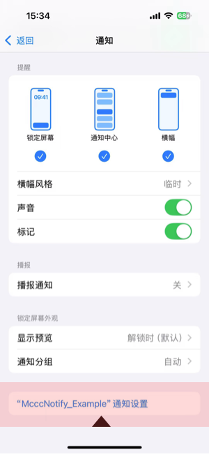

# 通知交互设计全解：前台显示、按钮交互与用户行为响应


## 一、前台通知不显示？其实是设计如此！

在使用本地通知时，开发者常常会遇到这样的困惑：

> **同样的通知请求，为什么在后台能弹出，在前台却毫无动静？**

这并不是 Bug，而是 **iOS 的系统默认行为**：它根据 App 的运行状态对通知展示策略进行了差异化处理。

### iOS 不同状态下的通知展示行为

| App 状态                 | 通知默认表现说明                                             |
| ------------------------ | ------------------------------------------------------------ |
| **后台 / 锁屏 / 被杀死** | 系统自动弹出横幅、播放声音、更新角标，用户直观可感。         |
| **前台运行中**           | **默认不弹窗、不响铃、不亮角标**，但通知内容依然会送达 App，由开发者决定如何展示。 |

这样的设计可以**避免打扰用户当前操作**，同时赋予开发者更灵活的展示策略。

### 如何让通知在前台也显示？

你需要借助系统提供的 `UNUserNotificationCenterDelegate` 协议。该协议提供了多个方法，用于管理通知的展示与响应，核心如下

```
public protocol UNUserNotificationCenterDelegate : NSObjectProtocol {

    optional func userNotificationCenter(_ center: UNUserNotificationCenter, willPresent notification: UNNotification, withCompletionHandler completionHandler: @escaping (UNNotificationPresentationOptions) -> Void)

    optional func userNotificationCenter(_ center: UNUserNotificationCenter, didReceive response: UNNotificationResponse, withCompletionHandler completionHandler: @escaping () -> Void)

    optional func userNotificationCenter(_ center: UNUserNotificationCenter, openSettingsFor notification: UNNotification?)
}
```

该协议主要负责以下几方面：

- **前台通知展示控制**
  通过实现 `willPresent` 方法，开发者可以决定当 App 处于前台时，是否弹出通知横幅、播放声音、更新角标等，弥补系统默认不显示通知的行为。
- **用户与通知的交互响应**
  实现 `didReceive` 方法，处理用户点击通知或通知中按钮的动作，完成页面跳转、数据处理等操作，无论 App 是前台、后台还是刚启动状态。
- **通知设置跳转回调**
  通过 `openSettingsFor` 方法，支持用户从通知界面快速跳转到应用通知设置页，提供定制化的设置体验。

#### 让前台通知可见

在合适的时机设置代理：

```
UNUserNotificationCenter.current().delegate = self
```

然后实现代理方法，告知系统前台如何展示通知：

```
extension YourViewController: UNUserNotificationCenterDelegate {
    func userNotificationCenter(_ center: UNUserNotificationCenter,
                                willPresent notification: UNNotification,
                                withCompletionHandler completionHandler: @escaping (UNNotificationPresentationOptions) -> Void) {
        // 指定前台展示通知的方式
        completionHandler([.banner, .sound])
    }
}
```

 `UNNotificationPresentationOptions` 可选值：

- `.banner`：显示横幅
- `.sound`：播放声音
- `.badge`：更新角标
- `.list`：加入通知中心列表

如果传入空数组（`[]`），则前台不会有任何可视通知，等同于系统默认行为。


## 二、让通知动起来：给通知添加交互

通知不仅能传递信息，更可以承载操作行为。iOS 支持在通知中添加：

- **按钮操作（`UNNotificationAction`）**
- **文字输入（`UNTextInputNotificationAction`）**

你可以实现如“完成任务”、“快速回复”、“延迟提醒”等操作，**无需打开 App 就能完成业务闭环**，极大提升效率。


### 三个核心对象的协同关系

要实现交互式通知，需要理解三个关键组件之间的结构关系：

| 组件     | 类型                                                     | 作用                                           |
| -------- | -------------------------------------------------------- | ---------------------------------------------- |
| 按钮     | `UNNotificationAction` / `UNTextInputNotificationAction` | 定义按钮样式、标识、权限                       |
| 分类     | `UNNotificationCategory`                                 | 组合多个按钮，并赋予唯一 `identifier`          |
| 通知内容 | `UNMutableNotificationContent`                           | 通过 `categoryIdentifier` 绑定到某个按钮分类上 |

只有当分类已注册，且通知的 `categoryIdentifier` 与之匹配时，系统才会显示按钮。


### 配置交互按钮的完整流程

#### 1. 创建按钮对象

你可以配置多个按钮，不同按钮可以有不同的权限和表现方式：

```
let doneAction = UNNotificationAction(
    identifier: "MARK_DONE",
    title: "完成",
    options: [.authenticationRequired] 
)

let inputAction = UNTextInputNotificationAction(
    identifier: "INPUT",
    title: "输入框",
    options: [.authenticationRequired, .foreground]
)
```

**UNNotificationActionOptions 详解**

`UNNotificationActionOptions` 是一个位掩码类型（`OptionSet`），用于配置通知按钮的行为特点。选项包括：

| 选项名                    | 作用说明                                                     |
| ------------------------- | ------------------------------------------------------------ |
| `.authenticationRequired` | 用户点击该按钮时，系统会先要求用户解锁设备（Touch ID/Face ID 或密码），增强安全性。适合敏感操作。 |
| `.destructive`            | 按钮被标记为“破坏性操作”，系统会使用红色突出显示按钮文本，提醒用户操作不可逆，通常用于删除、拒绝等场景。 |
| `.foreground`             | 点击按钮后会自动启动或唤醒 App 进入前台，适合需要立即打开 App 处理的操作（默认按钮点击不会唤醒 App）。 |


#### 2. 创建并注册通知分类

将按钮组打包为一个分类，并在通知中心注册，注册是**按钮生效的前提**：

```
let category = UNNotificationCategory(
    identifier: "TODO_CATEGORY",
    actions: [doneAction, inputAction],
    intentIdentifiers: [],
    options: []
)

// 注册分类，必须调用，否则按钮不会显示
UNUserNotificationCenter.current().setNotificationCategories([category])
```

注册通知的交互按钮后，**系统需要一点时间将这些设置生效**，这是一种**异步生效机制**。如果你立刻添加通知：

```
UNUserNotificationCenter.current().setNotificationCategories([category])
UNUserNotificationCenter.current().add(request) // ⚠️ 可能无效
```

这种写法在 **App 首次运行时（即第一次调用这个方法）** 很可能导致：

> 通知被成功调度了，但按钮 **不会显示**，因为系统还没注册好对应的 category。


##### intentIdentifiers

`intentIdentifiers` 是一个 `[String]`，表示你想让这个通知类别关联到哪些 **`INIntent` 类型**（SiriKit 的 Intent 类），供系统智能识别或在 Siri 建议中使用。

如果你**没有使用 SiriKit 或不涉及特定 Intents**，就可以留空（传 `[]`）——这在绝大多数场景下都没问题。


##### `options` 是什么？

`options` 是一个 `UNNotificationCategoryOptions` 类型的 **位掩码（OptionSet）**，用于配置通知类别的行为特性。它控制了**通知界面的显示方式、用户操作时的系统处理方式**等。

| Option 常量名                            | 含义说明                                                   |
| ---------------------------------------- | ---------------------------------------------------------- |
| `.customDismissAction`                   | 用户手动滑掉通知时也会触发 `didReceive` 回调（可感知取消） |
| `.allowInCarPlay`                        | 通知可以在 CarPlay（车载）环境中展示                       |
| `.hiddenPreviewsShowTitle` （iOS 11+）   | 通知在锁屏隐藏预览时仍显示标题                             |
| `.hiddenPreviewsShowSubtitle`（iOS 11+） | 通知在锁屏隐藏预览时仍显示副标题                           |
| `.allowAnnouncement`（iOS 13+）          | 支持通过 VoiceOver 进行“语音播报通知”                      |


#### 3. 创建通知内容并绑定分类

```
let content = UNMutableNotificationContent()
content.title = "📌 每日提醒"
content.body = "别忘了写日报！"
content.categoryIdentifier = "TODO_CATEGORY" // 必须与分类 identifier 一致
```

此时，通知内容就通过 `categoryIdentifier` 与已注册的按钮组建立了关联，触发后系统会自动识别并展示对应按钮。


### 关于按钮展示的额外说明

- 用户需要**长按或下拉通知**才能展开按钮（是系统交互设计，避免误触）。
- **一个通知只能绑定一个 category**，即每条通知最多只能展示一组按钮。
- 如果你的 App 中存在多种通知交互需求，应**提前注册多个分类**，并在构建通知内容时灵活指定对应的 `categoryIdentifier`。


## 三、让通知动起来：处理交互响应

我们介绍了如何为通知添加交互按钮和文字输入框，实现可操作的通知。接下来，本章将重点讲解**用户点击按钮或输入文本后的事件处理机制**，帮助你接收用户操作并执行相应逻辑。


### 1. 用户点击了按钮？如何拦截与识别

用户点击通知内容或按钮后，系统会调用：

```
func userNotificationCenter(_ center: UNUserNotificationCenter,
                            didReceive response: UNNotificationResponse,
                            withCompletionHandler completionHandler: @escaping () -> Void) {
    
    switch response.actionIdentifier {
    case UNNotificationDefaultActionIdentifier:
        print("用户点击了通知本体")
        
    case "MARK_DONE":
        print("用户点击了“完成”按钮")
        
    case "SNOOZE":
        print("用户点击了“稍后提醒”按钮")
        
    default:
        break
    }

    // 告诉系统处理完成
    completionHandler()
}
```

这个回调会在用户点击通知本体或按钮时触发，支持你识别用户的交互行为并执行相应逻辑。

#### 核心参数说明：

- `response.actionIdentifier`：用户点击的元素标识，需与 `UNNotificationAction.identifier` 预设一致。
- `UNNotificationDefaultActionIdentifier`：系统内置常量，代表用户点击的是通知本体，而非按钮。
- `response.notification`：包含完整的通知内容，可通过 `userInfo` 携带业务参数进行进一步处理。
- `completionHandler()`：**必须调用**，否则可能阻塞通知响应链。

通过判断 `actionIdentifier`，你可以在 App 中完成页面跳转、数据更新、任务状态处理等操作，实现真正的通知交互体验。


### 3. 输入类按钮的 `userText` 怎么拿？

对于带文字输入的按钮（`UNTextInputNotificationAction`），我们可以在通知交互回调中获取用户提交的文本内容，常用于“快速回复”、“反馈建议”等场景。

示例代码如下：

```
if let textResponse = response as? UNTextInputNotificationResponse {
    let userText = textResponse.userText
    print("用户输入了：\(userText)")
    // 这里可以处理用户的回复内容，比如发送消息
}
```

这个方法在 `UNUserNotificationCenterDelegate` 的 `didReceive response` 中被触发，仅当 App 在**前台**或**后台活跃状态**下，用户与通知交互时才会调用。


#### App 被杀死状态不能处理输入

App 若被用户划掉或系统清理内存杀死：

- **不会收到回调**
- **不会被唤醒**
- **不能获取任何输入数据**

也就是说，这种交互**表面看起来“用户回复了”，但你的 App 实际上什么也没收到**。

#### 那微信是怎么做到的？

微信等头部 App 可以实现“杀死状态下仍能处理回复”，靠的是：

| 能力             | 微信 / 钉钉等              | 普通 App            |
| ---------------- | -------------------------- | ------------------- |
| 私有系统通道     | 与系统服务协作             | ❌ 无法访问          |
| 后台处理进程     | 例如使用 VoIP 保活         | ❌ 被严格限制        |
| 输入内容后台上传 | 用户输入被系统上传至服务器 | ❌ 本地 App 无法触发 |

系统直接将用户输入**上传给服务端**，绕过本地 App 启动。这种机制普通 App 无法实现。


## 四、在系统设置中添加App的通知设置页面捷径

点击该按钮，唤起app，进入app的通知设置页面。



    func userNotificationCenter(_ center: UNUserNotificationCenter, openSettingsFor notification: UNNotification?) {
        // App内跳转设置页     
        let vc = BViewController()
        present(vc, animated: true, completion: nil)
    }

我们不仅要实现这个协议方法，并完成对应的页面跳转。还要在申请权对应的权限：

```
UNUserNotificationCenter.current().requestAuthorization(
    options: [.alert, .sound, .badge, .providesAppNotificationSettings]) { granted, error in
        
}
```

