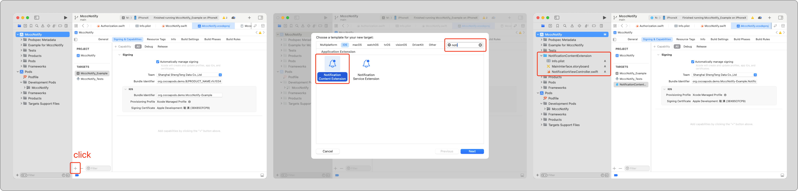
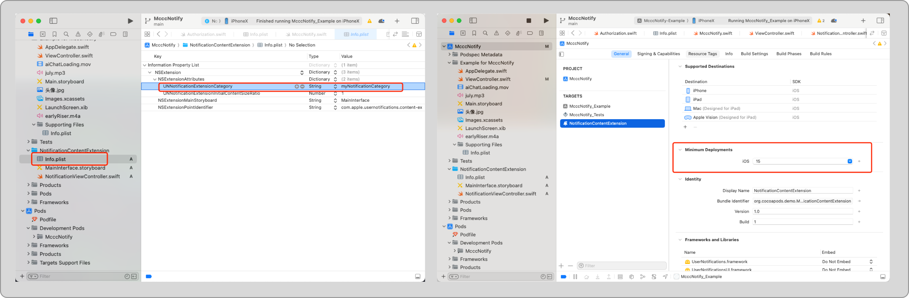

# 推送的扩展能力 — 打造个性化的通知体验

现代 App 的通知早已不仅仅是简单的文字提醒。设计良好的推送通知可以呈现丰富的视觉卡片，也能作为安全可控的消息通道，让用户在不打开 App 的情况下，获取关键信息并完成操作。

为满足这些高级需求，iOS 提供了 **Notification Content Extension（通知内容扩展）**，它允许你在通知展示时，使用自定义界面替代系统默认样式，打造更丰富的视觉和交互体验。

## 一、什么是 Notification Content Extension？

Notification Content Extension 是 iOS 在通知展示阶段调用的一个独立模块，允许开发者：

- 提供自定义的通知界面
- 展示富媒体内容（图文、音视频预览）
- 支持交互操作（按钮、文本输入等）

典型应用场景包括：

- 新闻类 App 展示文章摘要和封面图
- 电商类 App 展示商品卡片
- 视频类 App 预览内容片段

## 二、创建通知的扩展



需要在项目中**新增一个扩展模块（Target）**。

* 击左下角的 `+` 按钮（见上图红框处），进入 “Add Target” 界面。
* 选择 `Notification Content Extension`，填写名称并完成创建。

## 三、将扩展绑定到通知

### 为什么需要将通知扩展绑定到通知？

通知内容扩展是独立模块，系统不会自动知道它处理哪些通知。
**只有绑定了对应的通知分类（categoryIdentifier），系统才能调用对应扩展展示和处理通知。**

如果不绑定，扩展不会生效，通知只能按系统默认样式展示。

### 绑定步骤

为了让通知扩展正确处理通知，需要确保以下三部分的 `categoryIdentifier` 保持一致：

#### 1. 通知内容中设置 `categoryIdentifier`

```
let content = UNMutableNotificationContent()
content.title = "每日一句"
content.body = "你若盛开，清风自来"
content.categoryIdentifier = "dailyQuotes"   // 分类标识
```

#### 2. 创建并注册通知分类

在 App 启动时，创建一个与通知中的分类标识相同的通知分类，并注册给系统：

```
let category = UNNotificationCategory(
    identifier: "dailyQuotes",  
    actions: [doneAction, inputAction],
    intentIdentifiers: [],
    options: []
)

// 注册分类，必须调用，否则按钮不会显示
UNUserNotificationCenter.current().setNotificationCategories([category])
```

这样，系统收到带有 `"categoryIdentifier": "my_custom_category"` 的通知时，会自动调用绑定了该 category 的通知扩展来展示和交互。

#### 3. 通知扩展 Info.plist 中声明支持的 category

通知扩展的 `Info.plist` 文件里，需要在 `NSExtension → NSExtensionAttributes → UNNotificationExtensionCategory` 字段填写相同的分类标识（如 `"dailyQuotes"`），告诉系统该扩展负责处理此类通知。

设置**通知扩展的 target 最低部署版本 (Deployment Target)** 不能高于你测试设备的系统版本，否则系统根本不会加载这个扩展，即便你的主 App 是可以运行的。



##### 

## 四、通知扩展 Info.plist 配置详解

```
<key>NSExtension</key>
<dict>
    <!-- 声明扩展类型为通知内容扩展 -->
    <key>NSExtensionPointIdentifier</key>
    <string>com.apple.usernotifications.content-extension</string>

    <!-- 通知扩展属性配置 -->
    <key>NSExtensionAttributes</key>
    <dict>
        <!-- 支持的 categoryIdentifier（与通知内容中设置的 categoryIdentifier 一致）-->
        <key>UNNotificationExtensionCategory</key>
        <array>
            <string>dailyQuotes</string>
            <string>taskReminder</string>
            <string>mediaAlert</string>
        </array>

        <!-- 展开时是否隐藏系统默认标题、正文、图片，仅显示扩展视图 -->
        <key>UNNotificationExtensionDefaultContentHidden</key>
        <true/>

        <!-- 控制初始展开高度：0.0 ~ 1.0，默认 1.0 是一半屏幕 -->
        <key>UNNotificationExtensionInitialContentSizeRatio</key>
        <real>0.7</real>

        <!-- 是否允许用户与扩展界面交互（按钮、文本输入等）-->
        <key>UNNotificationExtensionUserInteractionEnabled</key>
        <true/>

        <!-- 是否使用扩展自定义的标题，替代系统默认通知标题 -->
        <key>UNNotificationExtensionOverridesDefaultTitle</key>
        <true/>

        <!-- 如果展示音视频，是否显示播放按钮（default / none / overlay）-->
        <key>UNNotificationExtensionMediaPlayPauseButtonType</key>
        <string>overlay</string>

        <!-- 声明支持的媒体类型（如 public.audio、public.movie） -->
        <key>UNNotificationExtensionMediaFileTypes</key>
        <array>
            <string>public.audio</string>
            <string>public.movie</string>
        </array>
    </dict>
</dict>
```

| **Key 名称**                                      | **作用**                                             | **类型**       | **默认值** | **用途说明**                                                 |
| ------------------------------------------------- | ---------------------------------------------------- | -------------- | ---------- | ------------------------------------------------------------ |
| `UNNotificationExtensionCategory`                 | 支持的通知分类，匹配通知中的 `categoryIdentifier`    | `[String]`数组 | 无         | 必填。系统根据此字段判断哪些通知调用该扩展。                 |
| `UNNotificationExtensionDefaultContentHidden`     | 是否隐藏系统默认标题、正文及附件，完全自定义展示内容 | `Bool`         | `false`    | 设置为 `true` 时，隐藏系统内容，仅显示自定义扩展界面。       |
| `UNNotificationExtensionInitialContentSizeRatio`  | 通知扩展展开时的最大初始高度（相对于屏幕高度）       | `Float`        | `1.0`      | 设置扩展最大展开高度比例，范围 0.0~1.0，内容不足时不会撑满。 |
| `UNNotificationExtensionUserInteractionEnabled`   | 是否允许用户与扩展界面交互（按钮、输入框等）         | `Bool`         | `true`     | 控制扩展视图的交互能力。                                     |
| `UNNotificationExtensionOverridesDefaultTitle`    | 是否由扩展自定义标题显示，替代系统默认标题           | `Bool`         | `false`    | 设置为 `true` 后，默认标题不显示，需扩展自行处理标题显示。   |
| `UNNotificationExtensionMediaPlayPauseButtonType` | 媒体通知中播放/暂停按钮的样式                        | `String`       | `default`  | 仅针对音视频通知。可选值：`default`、`overlay`、`none`。     |
| `UNNotificationExtensionMediaFileTypes`           | 支持处理的媒体类型（UTType）                         | `[String]`数组 | 无         | 声明扩展支持的媒体文件类型，系统据此判断是否使用扩展展示该通知。 |

## 五、推送内容扩展的使用限制

- **展示区域有限**
  显示空间有限，最多展示一屏内容，用户需滑动查看全部信息，限制内容复杂度。
- **需要用户主动操作展开**
  扩展内容不会自动展开，用户需通过长按或下拉通知主动触发。
- **扩展内无法直接跳转 App**
  交互操作只能在通知界面完成，不能直接打开 App 页面。
- **不适合复杂业务流程**
  交互和展示空间有限，适合简单反馈和轻交互。
- **性能与资源限制**
  扩展运行于独立进程，响应时间有限（约30秒），资源占用受限，需保持高效稳定。


## 六、不能自动展示内容扩展的原因

只在用户 **主动操作通知** 时触发，开发者无权干预。

| 原因类型     | 说明                                                         |
| ------------ | ------------------------------------------------------------ |
| 安全考虑     | 扩展可展示敏感数据，自动展开可能泄露内容。                   |
| 交互一致性   | 保持通知轻量，需用户主动操作保证 UI 行为统一。               |
| 系统策略限制 | Content Extension 仅在用户主动操作通知时触发，开发者无法强制。 |


## 七、如何诱导用户长按展开通知？

iOS 通知扩展默认**不会自动展开**，需要用户通过**长按（锁屏/通知中心）**或**下拉（横幅）**的方式才能触发。因此，想要发挥通知扩展的价值，前提是“**让用户愿意去长按**”。

以下是几种实用策略，用于提升用户进行长按操作的意愿：

### 1. **在标题或内容中加入操作提示语**

明确告诉用户“长按可查看更多”是最简单直接的引导方式，尤其在消息、日程、任务提醒等场景非常有效：

```
content.title = "任务变更（长按查看详情）"
content.body = "你有一个待办事项已延期，长按可查看最新信息。"
```

📌 **建议位置：**

- 在 `title` 末尾加括号提示（不影响主标题）
- 在 `body` 中补充可操作性说明

### 2. **制造信息“断点感”** —— 激发点击欲望

设计内容时可以故意留“悬念”，让用户产生“点开看看”的冲动：

```
content.title = "你的日程有更新..."
content.body = "查看今日会议是否已取消？"
```

这种“半句未完”的表达常用于新闻推送、提醒通知、互动问候等场景，增强好奇心。

### 3. **利用 Emoji 和视觉符号吸引注意**

在标题中巧用 Emoji、图标字符，使通知在列表中更突出：

```
content.title = "📅 今日安排已更新（长按查看）"
content.body = "上午会议时间有调整，建议查看详情。"
```

适当使用视觉符号能有效提升通知可见度和可点性。

### 4. 匹配用户时机与意图（内容精准 + 时机合适）

推送应具备强相关性和时效性，增强用户点击意愿：

- 临近事件、限时提醒
- 用户订阅、收藏内容相关通知
- 明确的查看收益（优惠、奖励、反馈）

### 5. 利用图像预览提升吸引力

添加图片附件吸引用户长按查看大图：

```
if let attachment = UNNotificationAttachment.create(image: yourImage, options: nil) {
    content.attachments = [attachment]
}
```
