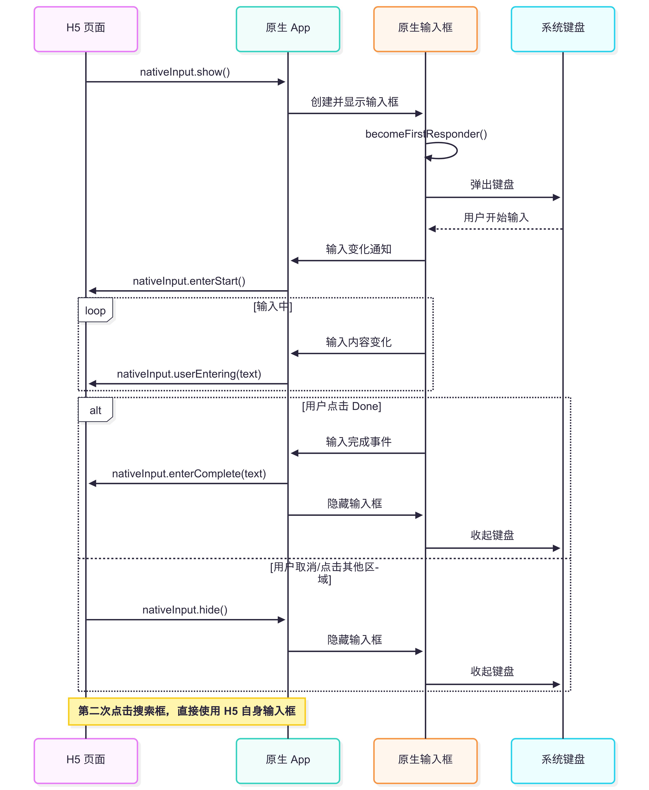

# WKWebView - 关于主动唤起键盘那些事

## 需求背景

在移动端的混合应用或内嵌网页中，常见的交互需求是**页面加载后自动聚焦输入框并弹出键盘**，以提升用户体验，例如：

- 搜索页自动定位到搜索框，方便快速输入
- 表单页自动激活首个必填项，减少额外点击
- 聊天窗口打开后直接进入输入状态，提高交互效率

但在 WKWebView 中，网页通过 JavaScript 的 `focus()` 主动让输入框获得焦点时，键盘往往不会弹出。
自 iOS 12 起，苹果对这种行为进行了限制：**只有在用户真实交互后，系统才允许键盘弹出**。


## 苹果官方设计考量

苹果禁止 WKWebView 在无用户操作的情况下主动弹出键盘，主要基于**安全、隐私和体验一致性**的考量。

### 官方禁止网页主动唤起键盘

#### 1. 防止网页滥用键盘弹出

如果允许任何网页在加载时主动 focus 输入框，可能会出现以下问题：

- 恶意网站自动弹出键盘，遮挡内容，强迫用户输入
- 页面反复 focus 造成用户体验混乱
- 弹出输入法时可能暴露部分屏幕内容或输入框预期外的位置

苹果希望**用户必须是主动操作**才会看到键盘，避免网页干扰。

#### 2. 保持一致的用户体验

在原生 iOS 应用里，大部分输入行为都是用户点击输入框才触发键盘。
WKWebView 作为系统 Web 渲染组件，也要遵守同样的交互规范，避免 Safari 和内嵌 WebView 行为不一致。

#### 3. 安全与隐私考虑

键盘可能包含：

- 自动填充账号、密码、邮箱
- 剪贴板内容
- 输入建议

如果网页能在没有用户感知的情况下主动唤起键盘，就有潜在的**诱导输入**和**钓鱼攻击**风险。


### 官方的不同策略

与此形成对比的是，**原生 UIKit 控件（如 `UITextField` ）可以无条件通过调用 `becomeFirstResponder()` 主动弹出键盘**，其原因包括：

- **运行环境可信**
  原生控件由 App 完全控制，系统对开发者意图和行为有充分信任。
- **调用可追踪**
  UIKit 能准确识别调用者和时机，调用意图清晰且可管理。
- **安全边界清晰**
  键盘弹出发生在本地环境，无远程脚本执行风险。
- **良好用户体验**
  通常配合明确的业务场景设计，用户对主动弹键盘行为接受度高。


综合来看，苹果对 WKWebView 和原生输入控件采取不同策略，既保护了用户安全与隐私，也保障了系统体验的一致性，同时赋予原生应用更灵活的控制能力。


## WKWebView 键盘弹出机制详解

### 1. `userIsInteracting` 参数的作用

在 `WKContentView` 的内部实现中，存在多个私有方法用于处理输入框的聚焦，例如 `_startAssistingNode` 和 `_elementDidFocus` 等。这些方法中包含一个布尔类型的参数 `userIsInteracting`，用于指示当前的聚焦操作是否由用户的真实交互（如点击、触摸）触发。

**当 `userIsInteracting`**

* 为 `true` 时：表示当前的聚焦操作是由用户的真实交互触发的，系统会允许键盘弹出。

-  为 `false` 时：表示当前的聚焦操作是由 JavaScript 等非用户交互方式触发的，系统会阻止键盘弹出。


### 2. 系统内部流程

WKWebView 的键盘弹出流程大致如下：

1. **用户交互触发**：当用户触摸或点击输入框时，`WKContentView` 的相关方法被调用，`userIsInteracting` 被设置为 `true`，系统识别为用户交互，允许键盘弹出。
2. **JavaScript 调用 `focus()`**：当 JavaScript 执行 `focus()` 方法时，调用同样的私有方法，但由于 `userIsInteracting` 为 `false`，系统识别为非用户交互，阻止键盘弹出。

[查看WebKit源码](https://github.com/WebKit/webkit)

## WKWebView 主动弹出键盘方案

## 让百度网页主动弹出键盘

```
import UIKit
import WebKit
import ObjectiveC.runtime

class ViewController: UIViewController, WKNavigationDelegate {

    private var webView: WKWebView!

    override func viewDidLoad() {
        super.viewDidLoad()

        // 创建 WKWebView
        webView = WKWebView(frame: view.bounds)
        webView.autoresizingMask = [.flexibleWidth, .flexibleHeight]
        webView.navigationDelegate = self
        view.addSubview(webView)

        // 加载百度
        if let url = URL(string: "https://www.baidu.com") {
            let request = URLRequest(url: url)
            webView.load(request)
        }
    }

    // WKNavigationDelegate — 页面加载完成回调
    func webView(_ webView: WKWebView, didFinish navigation: WKNavigation!) {
        // 延迟 0.5 秒，确保 DOM 渲染完成
        DispatchQueue.main.asyncAfter(deadline: .now() + 0.5) {
            let js = """
            var input = document.querySelector('input');
            if(input) { input.focus(); }
            """
            webView.evaluateJavaScript(js, completionHandler: nil)
        }
    }
}
```

运行这个代码发现，有部分手机是可以弹出来的。如果无法有效唤起，参考以下方法：


### 1. Hook 私有Api

通过 Hook `WKContentView` 的私有方法，将 `userIsInteracting` 强制改为 `true`，可以绕过系统限制。

```
//// MARK: - 绕过 WKWebView 键盘限制

初始化WebView之前调用 `WKWebView.allowDisplayingKeyboardWithoutUserAction()`。

extension WKWebView {

    static func allowDisplayingKeyboardWithoutUserAction() {
        guard let wkContentViewClass = NSClassFromString("WKContentView") else { return }

        let iOS_11_3_0 = OperatingSystemVersion(majorVersion: 11, minorVersion: 3, patchVersion: 0)
        let iOS_12_2_0 = OperatingSystemVersion(majorVersion: 12, minorVersion: 2, patchVersion: 0)
        let iOS_13_0_0 = OperatingSystemVersion(majorVersion: 13, minorVersion: 0, patchVersion: 0)

        let processInfo = ProcessInfo.processInfo

        if processInfo.isOperatingSystemAtLeast(iOS_13_0_0) {
            hookSelector(
                wkContentViewClass,
                sel: "_elementDidFocus:userIsInteracting:blurPreviousNode:activityStateChanges:userObject:",
                type: (@convention(c) (AnyObject, Selector, UnsafeRawPointer?, Bool, Bool, Bool, AnyObject?) -> Void).self
            )
        } else if processInfo.isOperatingSystemAtLeast(iOS_12_2_0) {
            hookSelector(
                wkContentViewClass,
                sel: "_elementDidFocus:userIsInteracting:blurPreviousNode:changingActivityState:userObject:",
                type: (@convention(c) (AnyObject, Selector, UnsafeRawPointer?, Bool, Bool, Bool, AnyObject?) -> Void).self
            )
        } else if processInfo.isOperatingSystemAtLeast(iOS_11_3_0) {
            hookSelector(
                wkContentViewClass,
                sel: "_startAssistingNode:userIsInteracting:blurPreviousNode:changingActivityState:userObject:",
                type: (@convention(c) (AnyObject, Selector, UnsafeRawPointer?, Bool, Bool, Bool, AnyObject?) -> Void).self
            )
        } else {
            hookSelector(
                wkContentViewClass,
                sel: "_startAssistingNode:userIsInteracting:blurPreviousNode:userObject:",
                type: (@convention(c) (AnyObject, Selector, UnsafeRawPointer?, Bool, Bool, AnyObject?) -> Void).self
            )
        }
    }

    /// Hook 方法实现
    private static func hookSelector<T>(_ cls: AnyClass, sel: String, type: T.Type) {
        let selector = NSSelectorFromString(sel)
        guard let method = class_getInstanceMethod(cls, selector) else { return }
        let originalImp = method_getImplementation(method)

        let block: @convention(block) (AnyObject, UnsafeRawPointer?, Bool, Bool, Bool, AnyObject?) -> Void = {
            me, arg0, _, arg2, arg3, arg4 in
            // 把 userIsInteracting 强制设为 true
            switch type {
            case is (@convention(c) (AnyObject, Selector, UnsafeRawPointer?, Bool, Bool, Bool, AnyObject?) -> Void).Type:
                let fn = unsafeBitCast(originalImp, to: (@convention(c) (AnyObject, Selector, UnsafeRawPointer?, Bool, Bool, Bool, AnyObject?) -> Void).self)
                fn(me, selector, arg0, true, arg2, arg3, arg4)
            case is (@convention(c) (AnyObject, Selector, UnsafeRawPointer?, Bool, Bool, AnyObject?) -> Void).Type:
                let fn = unsafeBitCast(originalImp, to: (@convention(c) (AnyObject, Selector, UnsafeRawPointer?, Bool, Bool, AnyObject?) -> Void).self)
                fn(me, selector, arg0, true, arg2, arg4)
            default:
                break
            }
        }

        method_setImplementation(method, imp_implementationWithBlock(block))
    }
}
```

由于是hook了系统的私有方法，当iOS系统升级时，有失效的风险，代码实现上需保证即使找不到方法签名也不能引起程序崩溃。 由于hook的私有方法签名字符串，有可能在AppStore审核期间被拒（有多个项目审核成功的情况）。


## 2. 原生输入框辅助H5唤起键盘

### 1. 方案背景

在 WKWebView 中，部分 iOS 系统版本下，JavaScript 调用 `focus()` 主动聚焦输入框可能无法稳定唤起键盘，影响 H5 搜索体验。
为保证可控且一致的输入体验，采用**直接使用原生输入框**的方式处理首次搜索输入，避免拼音输入法下的候选词显示问题。


### 2. 实现思路

H5 在需要搜索框时，通过桥协议通知原生直接显示一个 `UITextField` 作为搜索输入框，由原生负责键盘弹出与输入逻辑，并将输入过程和结果回传给 H5。首次输入使用原生控件，后续交互回归 H5 自身的输入框。


### 3. 交互流程




**H5 请求显示原生搜索框**

H5 调用桥方法：

```
nativeInput.show()
```

原生显示一个固定位置的搜索输入框（非透明），并自动 `becomeFirstResponder()` 弹出键盘。

**用户开始输入**

原生检测到输入框获取焦点并开始输入时，调用桥通知 H5 开始输入。

```
nativeInput.enterStart()
```

**输入过程同步**

用户输入内容变化时，原生实时回传：

```
nativeInput.userEntering({ text: "当前输入内容" })
```

H5 可根据输入更新搜索建议或执行其他逻辑。

**输入完成**

用户点击键盘 **Done** 按钮时，原生调用桥：

```
nativeInput.enterComplete({ text: "最终输入内容" })
```

H5 收到数据后执行搜索逻辑。

原生隐藏输入框并关闭键盘。

**中途退出输入**

如果用户未完成输入就点击其他区域或切换页面，H5 调用：

```
nativeInput.hide()
```

原生隐藏输入框并收起键盘。

**后续点击搜索框**

首次唤起使用原生输入框。

之后再次点击搜索框，直接使用 H5 自身输入框处理，不再唤起原生控件。

